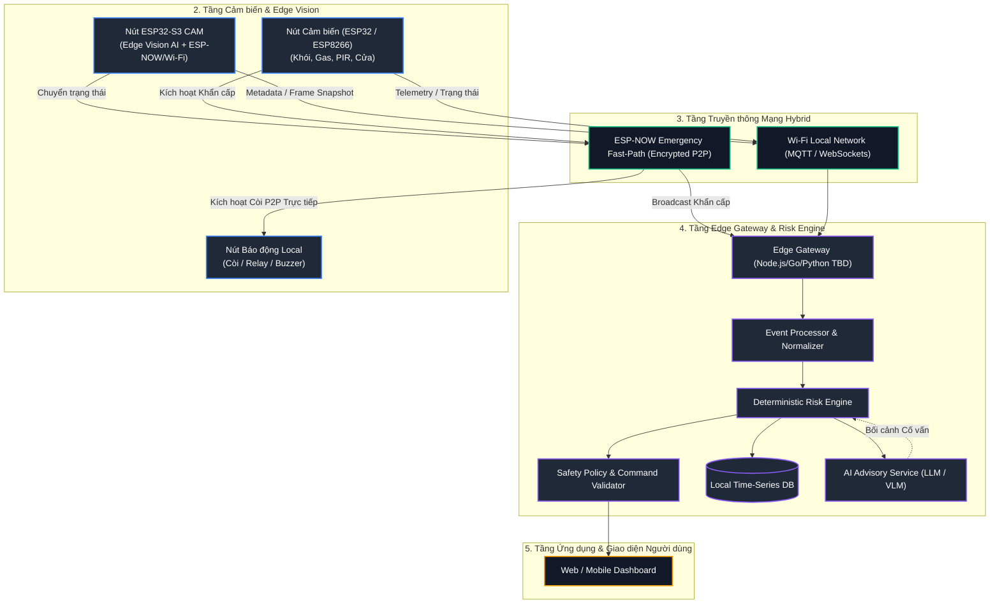

# SafeHome AI Mesh: Kiến trúc An toàn Nhà ở Phân tán Edge-AI

> **Trạng thái Dự án:** `[DECISION]` Giai đoạn Tài liệu Kỹ thuật & Blueprint  
> **Cuộc thi Trọng tâm:** Danang AI4Life Challenge  
> **Định hướng Cốt lõi:** An toàn Định tính (Deterministic Safety), Edge AI, Mạng Mesh Kháng lỗi & Xử lý Rủi ro  

---

## 1. Tóm tắt Tổng quan & Mô tả Ngắn

**SafeHome AI Mesh** là một hệ sinh thái an toàn nhà ở ưu tiên quyền riêng tư và xử lý tại Edge. Hệ thống kết hợp giữa vision AI trực tiếp trên thiết bị (ESP32-S3 WROOM N16R8 CAM), các nút cảm biến độ trễ thấp, kênh truyền mesh khẩn cấp định tính (ESP-NOW), và một Edge Gateway Risk Engine cục bộ nhằm cung cấp khả năng phản ứng khẩn cấp dưới 1 giây mà không phụ thuộc vào kết nối Cloud.

---

## 2. Vấn đề & Giải pháp Kỹ thuật

### Vấn đề (The Problem)
Các giải pháp an toàn nhà thông minh truyền thống gặp phải 3 điểm yếu cốt lõi:
1. **Độ trễ & Phụ thuộc Cloud (Cloud Latency & Dependency):** Các hệ thống gửi video/cảm biến lên cloud server để xử lý AI sẽ hoàn toàn thất bại khi mất mạng Internet hoặc bị trễ 2–5 giây—mức trễ không thể chấp nhận đối với cảnh báo cháy hoặc đột nhập.
2. **Quá tải Báo động giả (False Alarm Fatigue & Event Spam):** Các camera thông thường gửi liên tục mọi frame nhận diện (ví dụ: 30 FPS = 30 events/giây), gây nghẽn mạng và làm người dùng tắt thông báo do nhiễu bóng đổ, thú cưng hoặc lỗi nhận diện thoáng qua.
3. **Thực thi Bất định Rủi ro (Fragile Non-Deterministic Execution):** Việc tin tưởng vào các mô hình AI hoặc LLM phức tạp để trực tiếp điều khiển phần cứng an toàn (như mở khóa cửa, bật còi báo động) tạo ra rủi ro an toàn và an ninh cực kỳ nghiêm trọng.

### Giải pháp Kỹ thuật (The Technical Solution)
SafeHome AI Mesh giải quyết triệt để các vấn đề này thông qua thứ tự ưu tiên kiến trúc **Safety-over-Intelligence**:
* **Edge-First Computer Vision:** ESP32-S3 thực hiện local inference (MobileNet / Phát hiện Người & Thảm họa) trực tiếp trên SRAM/PSRAM.
* **Temporal Filtering & State Engine:** Lọc nhiễu nhận diện theo thời gian, loại bỏ báo động giả để chuyển thành sự kiện an toàn có trạng thái.
* **Kiến trúc Mạng Phân luồng Kép (Dual-Path Network):** 
  * *Kênh Khẩn cấp Nhanh (ESP-NOW):* Truyền tín hiệu mã hóa Peer-to-Peer trực tiếp giữa cảm biến/camera và nút còi báo động local (độ trễ <50ms, không phụ thuộc router Wi-Fi).
  * *Kênh Telemetry Tiêu chuẩn (Wi-Fi / MQTT / WebSocket):* Đồng bộ trạng thái, lịch sử sự kiện và stream giao diện UI lên Edge Gateway.
* **Deterministic Risk Engine:** Đánh giá các quy tắc an toàn định tính trước. AI reasoning và LLM chỉ đóng vai trò cố vấn (advisory), hoàn toàn bị cô lập khỏi việc điều khiển trực tiếp GPIO.

---

## 3. Tổng quan Kiến trúc Hệ thống



---

## 4. Danh mục Công nghệ Phần cứng & Phần mềm

| Lĩnh vực | Công nghệ / Phần cứng Lựa chọn | Chức năng / Nhiệm vụ | Trạng thái Kiến trúc |
| :--- | :--- | :--- | :--- |
| **Vision Edge Core** | ESP32-S3 WROOM N16R8 (16MB Flash, 8MB PSRAM) | Frame capture, MobileNet-V2 inference, ESP-NOW / Wi-Fi | `[DECISION]` |
| **Cảm biến Camera** | OV2640 / OV5640 | Bắt hình ảnh (độ phân giải QVGA / VGA cho AI) | `[DECISION]` |
| **Nút Cảm biến** | ESP32-C3 / ESP8266 + MQ-2/MQ-5, PIR, Reed Switch | Cảm biến sự cố môi trường & đột nhập | `[DECISION]` |
| **Edge Gateway** | Raspberry Pi 4B / Mini PC (Ubuntu OS) | Xử lý sự kiện local, risk engine, DB, WebSocket server | `[DECISION]` |
| **Cơ sở Dữ liệu** | SQLite / TimescaleDB `[TBD]` | Lưu trữ telemetry theo thời gian & audit log bất biến | `[TBD]` |
| **Backend Runtime** | Node.js (TypeScript) / Python (FastAPI) `[TBD]` | Gateway APIs, Risk Engine, WebSocket broker | `[TBD]` |
| **Giao diện Frontend**| Vite + React / Web Components | Dashboard giám sát độ trễ thấp & quản lý alert | `[DECISION]` |
| **Giao thức P2P** | ESP-NOW (Custom Encrypted Framing) | Truyền khẩn cấp sub-50ms (Cảm biến $\rightarrow$ Còi / Gateway) | `[DECISION]` |
| **Giao thức Tiêu chuẩn**| MQTT (Mosquitto) + WebSockets | Telemetry ingest và stream thông báo realtime cho UI | `[DECISION]` |

---

## 5. Các Nguyên tắc Kiến trúc Cốt lõi

1. **Xử lý Ưu tiên Edge (Edge-First Processing):** Mọi quyết định an toàn khẩn cấp phải thực thi trong mạng mesh cục bộ mà không cần kết nối WAN hay Cloud.
2. **AI Không Điều khiển Direct GPIO:** Mô hình AI (YOLO, LLM) chỉ đưa ra xác suất và gợi ý. Chỉ có **Deterministic Safety Policy** đã qua kiểm duyệt mới được phát lệnh điều khiển phần cứng.
3. **Cô lập Đường truyền Khẩn cấp (Emergency Fast-Path):** Tín hiệu khẩn cấp dùng ESP-NOW truyền P2P theo MAC address, bỏ qua hoàn toàn điểm nghẽn của Router Wi-Fi.
4. **Tạo Sự kiện Theo Thời gian (Temporal Event Generation):** Frame camera thô được lọc qua confidence score, nhận diện frame liên tiếp, debounce timer và hysteresis trước khi tạo thành `EVENT`.
5. **Safety over Intelligence:** Nếu AI gặp sự cố hoặc mất kết nối, các quy tắc ngưỡng định tính (như Cảm biến khói $> X \rightarrow$ Bật còi) nắm quyền ưu tiên tuyệt đối.

---

## 6. Trạng thái Dự án & Ma trận Tiến độ

```text
Trạng thái Dự án: Giai đoạn Tài liệu Kỹ thuật & Blueprint
```

| Mảng Hệ thống | Trạng thái Kiến trúc | Hành động Tiếp theo / Cột mốc |
| :--- | :--- | :--- |
| **System Requirements** | `READY` | Kiểm chứng ở giai đoạn phần cứng |
| **System & Component Architecture** | `READY` | Khởi tạo mô hình prototype |
| **ESP32 Edge Vision Pipeline** | `IN DESIGN` | Cấp phát bộ nhớ Tensor & Benchmark `[VERIFY]` |
| **AI Event Generation Model** | `READY` | Tinh chỉnh tham số Hysteresis |
| **ESP-NOW Emergency Fast Path** | `READY` | Hoàn thiện mã hóa & ghép nối MAC |
| **Edge Gateway & Risk Engine** | `IN DESIGN` | Kiểm chứng State Machine Rule |
| **Data Model & API Specification** | `READY` | Khởi tạo OpenAPI / Schema |
| **Security & Threat Model** | `READY` | Kiểm tra cơ chế Replay Protection |
| **Testing Strategy** | `READY` | Thực thi kiểm thử Hardware-in-the-loop |
| **Hardware BOM** | `READY` | Mua sắm linh kiện |
| **Demo Scenario Plan** | `READY` | Chuẩn bị kịch bản trình diễn |

---

## 7. Hướng dẫn Onboarding cho Developer Mới: "Tôi Nên Bắt đầu từ Đâu?"

Chào mừng bạn đến với **SafeHome AI Mesh**! Tùy theo vai trò chuyên môn, hãy đọc tài liệu theo lộ trình sau:

* **Lập trình viên Nhúng (Embedded / ESP32 Firmware):**
  1. [`docs/00-project-overview.md`](file:///d:/SAM/docs/00-project-overview.md)
  2. [`docs/05-esp32-edge-device.md`](file:///d:/SAM/docs/05-esp32-edge-device.md)
  3. [`docs/08-network-architecture.md`](file:///d:/SAM/docs/08-network-architecture.md)
  4. [`docs/09-esp-now-emergency-path.md`](file:///d:/SAM/docs/09-esp-now-emergency-path.md)
* **Kỹ sư AI / ML:**
  1. [`docs/06-ai-pipeline.md`](file:///d:/SAM/docs/06-ai-pipeline.md)
  2. [`docs/07-event-generation.md`](file:///d:/SAM/docs/07-event-generation.md)
  3. [`docs/adr/0003-ai-inference-strategy.md`](file:///d:/SAM/docs/adr/0003-ai-inference-strategy.md)
* **Lập trình viên Backend & Hệ thống Phân tán:**
  1. [`docs/03-system-architecture.md`](file:///d:/SAM/docs/03-system-architecture.md)
  2. [`docs/10-edge-gateway.md`](file:///d:/SAM/docs/10-edge-gateway.md) & [`docs/12-risk-engine.md`](file:///d:/SAM/docs/12-risk-engine.md)
  3. [`docs/13-data-model.md`](file:///d:/SAM/docs/13-data-model.md) & [`docs/14-api-specification.md`](file:///d:/SAM/docs/14-api-specification.md)
* **Lập trình viên Frontend:**
  1. [`docs/15-realtime-communication.md`](file:///d:/SAM/docs/15-realtime-communication.md)
  2. [`docs/14-api-specification.md`](file:///d:/SAM/docs/14-api-specification.md)
  3. [`docs/25-demo-scenario.md`](file:///d:/SAM/docs/25-demo-scenario.md)

---

## 8. Bản đồ Danh mục Tài liệu (Documentation Map)

Danh mục tra cứu toàn bộ tài liệu kỹ thuật trong thư mục `docs/`:

* [`00-project-overview.md`](file:///d:/SAM/docs/00-project-overview.md) — Mục tiêu tổng quan, đối tượng sử dụng, phạm vi Scope & Non-Scope.
* [`01-problem-statement.md`](file:///d:/SAM/docs/01-problem-statement.md) — Phân tích nguyên nhân thất bại của các hệ thống smart home hiện tại.
* [`02-requirements.md`](file:///d:/SAM/docs/02-requirements.md) — Danh sách yêu cầu hệ thống phân loại (REQ-001 đến REQ-031).
* [`03-system-architecture.md`](file:///d:/SAM/docs/03-system-architecture.md) — Sơ đồ kiến trúc C4 và phân tầng hệ thống.
* [`04-component-architecture.md`](file:///d:/SAM/docs/04-component-architecture.md) — Đặc tả kỹ thuật 8 điểm cho từng thành phần.
* [`05-esp32-edge-device.md`](file:///d:/SAM/docs/05-esp32-edge-device.md) — Kiến trúc firmware ESP32-S3, RAM budget (SRAM/PSRAM), camera setup.
* [`06-ai-pipeline.md`](file:///d:/SAM/docs/06-ai-pipeline.md) — Lựa chọn mô hình, lượng hóa INT8, Tensor Arena, quy trình suy luận Edge AI.
* [`07-event-generation.md`](file:///d:/SAM/docs/07-event-generation.md) — Pipeline Frame $\rightarrow$ Observation $\rightarrow$ Event & JSON schema.
* [`08-network-architecture.md`](file:///d:/SAM/docs/08-network-architecture.md) — Mô hình mạng Hybrid (ESP-NOW vs MQTT vs WebSockets).
* [`09-esp-now-emergency-path.md`](file:///d:/SAM/docs/09-esp-now-emergency-path.md) — Kênh khẩn cấp độ trễ thấp, quản lý MAC, mã hóa & anti-replay.
* [`10-edge-gateway.md`](file:///d:/SAM/docs/10-edge-gateway.md) — Mô hình Gateway, bộ chuẩn hóa tin nhắn, quản lý thiết bị & lưu trữ.
* [`11-event-processing.md`](file:///d:/SAM/docs/11-event-processing.md) — Hàng chờ Ingest Queue, khử trùng lặp (Deduplication), Idempotency.
* [`12-risk-engine.md`](file:///d:/SAM/docs/12-risk-engine.md) — Quy tắc định tính, tính điểm rủi ro, kiểm duyệt Safety Policy & giới hạn AI.
* [`13-data-model.md`](file:///d:/SAM/docs/13-data-model.md) — Schema cơ sở dữ liệu quan hệ, chỉ mục Index & Mermaid ERD.
* [`14-api-specification.md`](file:///d:/SAM/docs/14-api-specification.md) — Đặc tả API RESTful, định dạng Request/Response, mã lỗi.
* [`15-realtime-communication.md`](file:///d:/SAM/docs/15-realtime-communication.md) — WebSocket framing, channel subscription, quy tắc Persist-Before-Publish.
* [`16-security.md`](file:///d:/SAM/docs/16-security.md) — Phân tích mối đe dọa STRIDE, quản lý khóa, mã hóa, chống phát lại.
* [`17-privacy.md`](file:///d:/SAM/docs/17-privacy.md) — Trích xuất metadata trên thiết bị, chính sách lưu ảnh, tối thiểu hóa dữ liệu.
* [`18-fault-tolerance.md`](file:///d:/SAM/docs/18-fault-tolerance.md) — Ma trận xử lý sự cố mạng, Gateway ngắt kết nối, lệch xung nhịp.
* [`19-observability.md`](file:///d:/SAM/docs/19-observability.md) — Định dạng Log JSON, chỉ số Metrics, Heartbeat, đo độ trễ Latency.
* [`20-testing-strategy.md`](file:///d:/SAM/docs/20-testing-strategy.md) — Chiến lược kiểm thử Unit, Integration, HIL, AI Validation & Security.
* [`21-deployment.md`](file:///d:/SAM/docs/21-deployment.md) — Các phương án triển khai (Development, Edge Local, Demo, Cloud hybrid).
* [`22-local-development.md`](file:///d:/SAM/docs/22-local-development.md) — Cấu hình môi trường dev, mock simulator, chạy local gateway.
* [`23-hardware-bom.md`](file:///d:/SAM/docs/23-hardware-bom.md) — Danh mục vật tư phần cứng BOM, sơ đồ chân pinout, ước tính chi phí.
* [`24-project-roadmap.md`](file:///d:/SAM/docs/24-project-roadmap.md) — Lộ trình Phase 0 đến Phase 12, tiêu chí nghiệm thu & MVP Definition.
* [`25-demo-scenario.md`](file:///d:/SAM/docs/25-demo-scenario.md) — Kịch bản trình diễn thực tế cho cuộc thi Danang AI4Life.
* [`26-troubleshooting.md`](file:///d:/SAM/docs/26-troubleshooting.md) — Hướng dẫn chẩn đoán sự cố phần cứng, mạng và Gateway.
* [`27-glossary.md`](file:///d:/SAM/docs/27-glossary.md) — Thuật ngữ kỹ thuật và khái niệm trong dự án.
* [`adr/`](file:///d:/SAM/docs/adr/) — Hồ sơ Quyết định Kiến trúc (ADR-0001 đến ADR-0005).
* [`DOCUMENTATION_AUDIT.md`](file:///d:/SAM/docs/DOCUMENTATION_AUDIT.md) — Báo cáo Đánh giá Kiến trúc & Tóm tắt Độ sẵn sàng Triển khai.