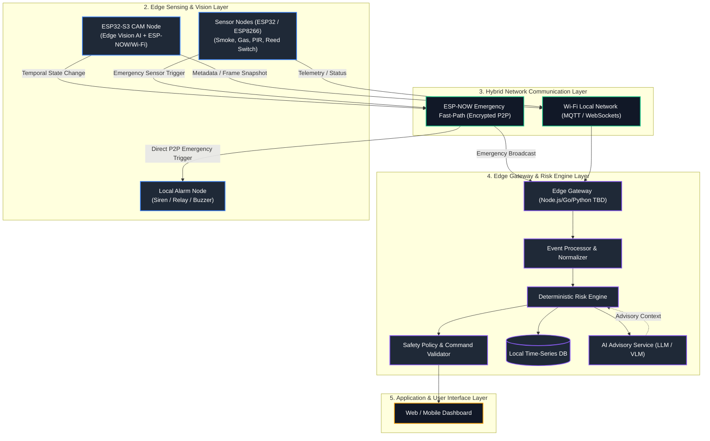

# SafeHome AI Mesh: Distributed Edge-AI Home Safety Architecture

> **Project Status:** `[DECISION]` Documentation & Blueprint Phase  
> **Target Competition:** Danang AI4Life Challenge  
> **Core Focus:** Deterministic Safety, Edge AI, Resilient Mesh Communication & Risk Processing  

---

## 1. Executive Summary & One-Line Description

**SafeHome AI Mesh** is a privacy-first, edge-centric home safety ecosystem that combines on-device vision AI (ESP32-S3 WROOM N16R8 CAM), low-latency sensor nodes, deterministic emergency mesh channels (ESP-NOW), and a local Edge Gateway risk engine to provide sub-second emergency response without relying on cloud connectivity.

---

## 2. Problem & Technical Solution

### The Problem
Traditional smart home safety solutions suffer from three fundamental vulnerabilities:
1. **Cloud Latency & Dependency:** Systems that send video/sensor feeds to cloud servers for AI analysis fail during internet outages or experience 2–5 second delays—unacceptable for fire or intrusion alerts.
2. **False Alarm Fatigue & Event Spam:** Naïve vision setups stream raw detection frames (e.g., 30 FPS = 30 events/sec), causing network congestion and flooding users with false alerts caused by pets, shadows, or brief detection glitches.
3. **Fragile Non-Deterministic Execution:** Relying on complex non-deterministic AI models or LLMs to directly actuate safety hardware (e.g., opening door locks, triggering sirens) creates unacceptable safety, security, and liability risks.

### The Technical Solution
SafeHome AI Mesh solves these issues through an explicit **Safety-over-Intelligence** architectural hierarchy:
* **Edge-First Computer Vision:** ESP32-S3 performs local inference (MobileNet / Person & Hazard detection) using SRAM/PSRAM.
* **Temporal Filtering & State Engine:** Converts noisy frame-level detections into debounced, stateful safety events.
* **Dual-Path Network Architecture:** 
  * *Emergency Fast Path (ESP-NOW):* Direct peer-to-peer encrypted communication between sensors/cameras and local alarm nodes (<50ms latency, zero Wi-Fi router dependency).
  * *Standard Telemetry Path (Wi-Fi / MQTT / WebSocket):* Rich state synchronization, event history, and UI streaming to the Edge Gateway.
* **Deterministic Risk Engine:** Safety policies evaluate deterministic rules first. AI reasoning and LLMs serve only as advisory layers, completely decoupled from direct GPIO control.

---

## 3. High-Level System Architecture



---

## 4. Hardware & Software Tech Stack

| Domain | Selected Technology / Hardware | Purpose / Function | Architectural Status |
| :--- | :--- | :--- | :--- |
| **Vision Edge Core** | ESP32-S3 WROOM N16R8 (16MB Flash, 8MB PSRAM) | On-device frame capture, MobileNet-V2 inference, ESP-NOW / Wi-Fi | `[DECISION]` |
| **Camera Sensor** | OV2640 / OV5640 | Image capture (QVGA / VGA resolution for AI inference) | `[DECISION]` |
| **Sensor Nodes** | ESP32-C3 / ESP8266 + MQ-2/MQ-5, PIR, Reed Switch | Environmental hazard sensing & perimeter detection | `[DECISION]` |
| **Local Gateway** | Raspberry Pi 4B / Mini PC (Ubuntu OS) | Local event processing, risk evaluation, DB, WebSocket server | `[DECISION]` |
| **Database** | SQLite / TimescaleDB `[TBD]` | Local time-series telemetry and immutable security audit logs | `[TBD]` |
| **Backend Runtime** | Node.js (TypeScript) / Python (FastAPI) `[TBD]` | Gateway APIs, Risk Engine execution, WebSocket broker | `[TBD]` |
| **Frontend UI** | Vite + React / Web Components | Low-latency monitoring dashboard & alert management | `[DECISION]` |
| **P2P Protocol** | ESP-NOW (Custom Encrypted Framing) | Sub-50ms emergency broadcast path (Sensor $\rightarrow$ Siren / Gateway) | `[DECISION]` |
| **Standard Protocol**| MQTT (e.g. Mosquitto) + WebSockets | Telemetry ingest and realtime client notification streaming | `[DECISION]` |

---

## 5. Architectural Principles Highlights

1. **Edge-First Processing:** Emergency decisions must execute within the local network mesh without requiring WAN or Cloud connectivity.
2. **AI Cannot Control GPIO Directly:** AI models (e.g. YOLO, LLM) generate probabilities and suggestions. Only validated **Deterministic Safety Policies** may issue hardware actuation commands.
3. **Emergency Fast-Path Isolation:** Critical sensor triggers use ESP-NOW direct MAC peer-to-peer transmission, completely bypassing Wi-Fi access point bottlenecks.
4. **Temporal Event Generation:** Raw camera frames are filtered via confidence scoring, consecutive frame matching, debounce timers, and hysteresis before generating a system `EVENT`.
5. **Safety over Intelligence:** If AI fails or disconnects, hardcoded deterministic threshold rules (e.g., Smoke sensor $> X \rightarrow$ Sound Siren) take complete priority.

---

## 6. Project Status & Matrix

```text
Project Status: Documentation & Architectural Blueprint Phase
```

| Subsystem Area | Current Architectural Status | Next Action / Milestone |
| :--- | :--- | :--- |
| **System Requirements** | `READY` | Verification in hardware phase |
| **System & Component Architecture** | `READY` | Prototype setup |
| **ESP32 Edge Vision Pipeline** | `IN DESIGN` | Tensor allocation & benchmark `[VERIFY]` |
| **AI Event Generation Model** | `READY` | Hysteresis parameter tuning |
| **ESP-NOW Emergency Fast Path** | `READY` | MAC pairing & cryptographic spec complete |
| **Edge Gateway & Risk Engine** | `IN DESIGN` | State machine rule validation |
| **Data Model & API Specification** | `READY` | OpenAPI / Schema creation |
| **Security & Threat Model** | `READY` | Replay protection verification |
| **Testing Strategy** | `READY` | Hardware-in-the-loop test execution |
| **Hardware BOM** | `READY` | Sourcing components |
| **Demo Scenario Plan** | `READY` | Execution script prep |

---

## 7. Developer Onboarding: Where Should I Start?

Welcome to **SafeHome AI Mesh**! Depending on your role, follow the reading order below to get up to speed quickly:

* **Embedded Developers (ESP32 / Firmware):**
  1. [`docs/00-project-overview.md`](file:///d:/SAM/docs/00-project-overview.md)
  2. [`docs/05-esp32-edge-device.md`](file:///d:/SAM/docs/05-esp32-edge-device.md)
  3. [`docs/08-network-architecture.md`](file:///d:/SAM/docs/08-network-architecture.md)
  4. [`docs/09-esp-now-emergency-path.md`](file:///d:/SAM/docs/09-esp-now-emergency-path.md)
* **AI / ML Engineers:**
  1. [`docs/06-ai-pipeline.md`](file:///d:/SAM/docs/06-ai-pipeline.md)
  2. [`docs/07-event-generation.md`](file:///d:/SAM/docs/07-event-generation.md)
  3. [`docs/adr/0003-ai-inference-strategy.md`](file:///d:/SAM/docs/adr/0003-ai-inference-strategy.md)
* **Backend & Distributed Systems Developers:**
  1. [`docs/03-system-architecture.md`](file:///d:/SAM/docs/03-system-architecture.md)
  2. [`docs/10-edge-gateway.md`](file:///d:/SAM/docs/10-edge-gateway.md)
  3. [`docs/11-event-processing.md`](file:///d:/SAM/docs/11-event-processing.md)
  4. [`docs/12-risk-engine.md`](file:///d:/SAM/docs/12-risk-engine.md)
  5. [`docs/13-data-model.md`](file:///d:/SAM/docs/13-data-model.md)
  6. [`docs/14-api-specification.md`](file:///d:/SAM/docs/14-api-specification.md)
* **Frontend Developers:**
  1. [`docs/15-realtime-communication.md`](file:///d:/SAM/docs/15-realtime-communication.md)
  2. [`docs/14-api-specification.md`](file:///d:/SAM/docs/14-api-specification.md)
  3. [`docs/25-demo-scenario.md`](file:///d:/SAM/docs/25-demo-scenario.md)

---

## 8. Documentation Map

Below is the complete navigational directory for the technical documentation suite located in `docs/`:

* [`00-project-overview.md`](file:///d:/SAM/docs/00-project-overview.md) — High-level goals, target audience, scope & non-scope boundaries.
* [`01-problem-statement.md`](file:///d:/SAM/docs/01-problem-statement.md) — Detailed domain analysis, failure modes of existing solutions.
* [`02-requirements.md`](file:///d:/SAM/docs/02-requirements.md) — Categorized system requirements (REQ-001 to REQ-050).
* [`03-system-architecture.md`](file:///d:/SAM/docs/03-system-architecture.md) — C4 architecture diagrams and multi-layer structural breakdown.
* [`04-component-architecture.md`](file:///d:/SAM/docs/04-component-architecture.md) — Comprehensive specification for every system component.
* [`05-esp32-edge-device.md`](file:///d:/SAM/docs/05-esp32-edge-device.md) — Firmware architecture, memory budgets (SRAM/PSRAM), camera setup.
* [`06-ai-pipeline.md`](file:///d:/SAM/docs/06-ai-pipeline.md) — Model selection, quantization, tensor arenas, and edge inference rules.
* [`07-event-generation.md`](file:///d:/SAM/docs/07-event-generation.md) — Frame $\rightarrow$ Observation $\rightarrow$ Event state engine & JSON schema.
* [`08-network-architecture.md`](file:///d:/SAM/docs/08-network-architecture.md) — Hybrid communications model (ESP-NOW vs MQTT vs WebSockets).
* [`09-esp-now-emergency-path.md`](file:///d:/SAM/docs/09-esp-now-emergency-path.md) — Low-latency emergency path specification, MAC handling, encryption & security.
* [`10-edge-gateway.md`](file:///d:/SAM/docs/10-edge-gateway.md) — Gateway services, normalizers, device management, and persistence adapters.
* [`11-event-processing.md`](file:///d:/SAM/docs/11-event-processing.md) — Event ingest queue, deduplication, idempotency, and routing.
* [`12-risk-engine.md`](file:///d:/SAM/docs/12-risk-engine.md) — Deterministic rules, score evaluation, safety policy validation, and AI advisory bounds.
* [`13-data-model.md`](file:///d:/SAM/docs/13-data-model.md) — Complete database schemas, field definitions, indexing, and Mermaid ERD.
* [`14-api-specification.md`](file:///d:/SAM/docs/14-api-specification.md) — RESTful API end-points, request/response formats, error states.
* [`15-realtime-communication.md`](file:///d:/SAM/docs/15-realtime-communication.md) — WebSocket framing, topics, subscription lifecycle, latency bounds.
* [`16-security.md`](file:///d:/SAM/docs/16-security.md) — Comprehensive threat model (STRIDE), encryption keys, authentication, replay protection.
* [`17-privacy.md`](file:///d:/SAM/docs/17-privacy.md) — On-device metadata extraction, image retention policies, data minimization.
* [`18-fault-tolerance.md`](file:///d:/SAM/docs/18-fault-tolerance.md) — Network partition strategies, gateway outages, clock drift recovery table.
* [`19-observability.md`](file:///d:/SAM/docs/19-observability.md) — Metrics, log formats, health heartbeats, latencies tracking.
* [`20-testing-strategy.md`](file:///d:/SAM/docs/20-testing-strategy.md) — Unit, integration, HIL, model validation, and security test matrices.
* [`21-deployment.md`](file:///d:/SAM/docs/21-deployment.md) — Deployment modes (Development, Edge Local, Demo, Cloud hybrid).
* [`22-local-development.md`](file:///d:/SAM/docs/22-local-development.md) — Dev environment setup, mocks, simulators, local gateway execution.
* [`23-hardware-bom.md`](file:///d:/SAM/docs/23-hardware-bom.md) — Complete Bill of Materials, pinouts, cost estimates, sourcing links.
* [`24-project-roadmap.md`](file:///d:/SAM/docs/24-project-roadmap.md) — Phase 0 to Phase 12 roadmap with deliverables and acceptance criteria.
* [`25-demo-scenario.md`](file:///d:/SAM/docs/25-demo-scenario.md) — Step-by-step competition demo walkthrough & scripts for Danang AI4Life.
* [`26-troubleshooting.md`](file:///d:/SAM/docs/26-troubleshooting.md) — Hardware, network, and gateway diagnostic guide.
* [`27-glossary.md`](file:///d:/SAM/docs/27-glossary.md) — Technical terms, abbreviations, and domain concepts.
* [`adr/`](file:///d:/SAM/docs/adr/) — Architectural Decision Records (ADR-0001 through ADR-0005).
* [`DOCUMENTATION_AUDIT.md`](file:///d:/SAM/docs/DOCUMENTATION_AUDIT.md) — Gap analysis, architectural risks, and Implementation Readiness Summary.
# SAM

