# 01 - Phát biểu Vấn đề (Problem Statement)

> **Trạng thái Tài liệu:** `[DECISION]` Đặc tả Cơ sở  
> **Trọng tâm:** Phân tích Nguyên nhân Kiến trúc Thất bại của các Hệ thống Smart Home Hiện tại  

---

## 1. Bối cảnh Ngành & Các Điểm yếu Cốt lõi của Hệ thống Hiện tại

Các giải pháp an ninh và nhà thông minh hiện đại phụ thuộc quá nhiều vào kiến trúc Cloud tập trung. Mặc dù mô hình này giúp phát triển ứng dụng nhanh chóng, nó lại tạo ra những điểm hỏng hóc chí mạng (Failure Modes) khi áp dụng vào **các hệ thống an toàn nhạy cảm về thời gian**:

```text
Luồng Truyền thống (Nhiều Điểm Yếu):
ESP32 / Camera ──> Home Router ──> Public Internet ──> Cloud AI ──> Public Internet ──> Home Router ──> Siren Actuator
Độ trễ: 1500ms - 5000ms | Điểm hỏng hóc đơn lẻ (Single Points of Failure): 4 (Router, WAN, Cloud Provider, Local AP)
```

### Điểm hỏng 1: Phụ thuộc Mạng WAN & Sự cố Mạng Internet
Trong các tình huống khẩn cấp (như hỏa hoạn do chập điện, bão lớn, hoặc cố tình cắt cáp mạng khi đột nhập), hạ tầng Internet bị gián đoạn thường xuyên. Một hệ thống an ninh phụ thuộc vào Cloud endpoint (AWS/GCP) để phân tích AI hay phát hiện cháy sẽ hoàn toàn mất khả năng hoạt động đúng vào lúc cần thiết nhất.

### Điểm hỏng 2: Báo động Giả tràn ngập do Gửi Frame Thô
Các ứng dụng computer vision đơn giản thường đẩy thẳng mọi bounding box phát hiện được lên thông báo mạng. Với tốc độ 15–30 FPS, một người đi ngang qua phòng trong 5 giây sẽ tạo ra từ 75 đến 150 sự kiện cảnh báo. Điều này dẫn trực tiếp tới:
* Bị nghẽn kênh truyền mạng Wi-Fi 2.4GHz nội bộ.
* Làm cạn kiệt pin nhanh chóng trên các nút cảm biến không dây.
* Gây ra tâm lý mệt mỏi thông báo (Notification Fatigue), khiến người dùng tắt luôn tính năng cảnh báo.

### Điểm hỏng 3: Kích hoạt Bất định & Rủi ro An toàn
Một số dự án nhà thông minh mới cố gắng kết nối Generative AI (LLMs hoặc Vision-Language Models) trực tiếp tới các API điều khiển phần cứng. Bản chất của LLM là mang tính xác suất (probabilistic) và dễ gặp hiện tượng ảo giác (hallucination). Việc cho phép một mô hình AI trực tiếp phát lệnh điều khiển GPIO (như `set_gpio(12, HIGH)` để mở van gas hoặc tắt còi báo động) tạo ra mối nguy hiểm không thể chấp nhận được.

---

## 2. Ma trận Giải pháp của SafeHome AI Mesh

| Điểm yếu (Vulnerability) | Giải pháp Kiến trúc của SafeHome AI Mesh | Cơ chế Kỹ thuật Cốt lõi |
| :--- | :--- | :--- |
| **Gián đoạn Cloud** | Kiến trúc Mesh Ưu tiên Edge (Edge-First) | Local ESP32-S3 inference + Local Gateway execution |
| **Sự cố Router Wi-Fi** | Cô lập Mạng Kênh Kép (Dual-Path Isolation) | Kênh không dây ESP-NOW Peer-to-Peer cho còi báo động |
| **Thông báo Rác** | Temporal State Engine | Debounce, hysteresis, kiểm tra frame liên tiếp |
| **Ảo giác AI** | Ghi đè An toàn Định tính (Deterministic Safety Override) | Tầng kiểm duyệt Safety Policy cô lập lệnh điều khiển |

---

## 3. So sánh Cấu trúc Đặc tính Thất bại

```mermaid
graph TD
    subgraph Traditional_Cloud_System ["Kiến trúc Cloud Truyền thống"]
        T1["Camera"] -->|Raw Stream| T2["Cloud NVR / Server"]
        T2 -->|AI Analysis| T3["Cloud Rules Engine"]
        T3 -->|Push Notification| T4["User Phone"]
        T3 -->|Cloud Command| T5["Smart Siren"]
        
        style T2 fill:#f87171,color:#000
        style T3 fill:#f87171,color:#000
    end

    subgraph SafeHome_AI_Mesh ["Kiến trúc SafeHome AI Mesh"]
        S1["Nút ESP32-S3 CAM"] -->|On-Device Vision AI| S2["Temporal State Engine"]
        S2 -->|ESP-NOW Emergency Fast-Path| S3["Nút Còi Local (<50ms)"]
        S2 -->|Wi-Fi Telemetry| S4["Local Gateway Risk Engine"]
        S4 -->|Validated Safety Policy| S5["Local Dashboard & Cảnh báo"]

        style S2 fill:#34d399,color:#000
        style S3 fill:#34d399,color:#000
        style S4 fill:#34d399,color:#000
    end
```


