# 01 - Problem Statement

> **Document Status:** `[DECISION]` Baseline Specification  
> **Key Focus:** Architectural Root-Cause Analysis of Smart Home Safety Failures  

---

## 1. Domain Background & Existing System Vulnerabilities

Modern residential security and home automation solutions rely heavily on centralized cloud architectures. While this pattern enables rapid development, it introduces critical failure modes when applied to **time-sensitive safety systems**:

```text
Traditional Flow (Vulnerable):
ESP32 / Camera ──> Home Router ──> Public Internet ──> Cloud AI ──> Public Internet ──> Home Router ──> Siren Actuator
Latency: 1500ms - 5000ms | Single Points of Failure: 4 (Router, WAN, Cloud Provider, Local AP)
```

### Failure Mode 1: WAN Dependency & Internet Outages
During emergencies (e.g., electrical fires, heavy storms, targeted break-ins), fiber/cable internet infrastructure is frequently disrupted. A security system that depends on an external AWS/GCP endpoint to process motion or detect fire becomes completely non-functional precisely when it is needed most.

### Failure Mode 2: Unfiltered Frame-Level Event Flooding
Naïve computer vision integration feeds every detected box straight to network notifications. At 15–30 frames per second (FPS), a person walking across a room for 5 seconds generates 75 to 150 alert triggers. This leads directly to:
* Network channel saturation on standard 2.4GHz Wi-Fi.
* Rapid battery depletion on wireless sensor nodes.
* Extreme user notification fatigue, leading users to turn off alerts.

### Failure Mode 3: Non-Deterministic Actuation & Safety Risks
Emerging smart home projects attempt to connect Generative AI (LLMs or Vision-Language Models) directly to physical hardware control APIs. LLMs are inherently probabilistic and subject to hallucinations. Allowing an AI model to directly output an actuation signal (e.g., `set_gpio(12, HIGH)` to open a gas valve or disarm an alarm) creates severe safety hazards.

---

## 2. SafeHome AI Mesh Solutions Matrix

| Vulnerability | Architectural Solution in SafeHome AI Mesh | Key Technical Mechanism |
| :--- | :--- | :--- |
| **Cloud Disruption** | Edge-First Mesh Architecture | Local ESP32-S3 inference + Local Gateway execution |
| **Wi-Fi AP Failure** | Dual-Path Network Isolation | ESP-NOW peer-to-peer wireless channel for alarms |
| **Notification Spam** | Temporal State Engine | Debounce, hysteresis, consecutive frame verification |
| **AI Hallucinations** | Deterministic Safety Override | Decoupled Safety Policy layer validating commands |

---

## 3. Structural Comparison of Failure Characteristics

```mermaid
graph TD
    subgraph Traditional_Cloud_System ["Traditional Cloud Architecture"]
        T1["Camera"] -->|Raw Stream| T2["Cloud NVR / Server"]
        T2 -->|AI Analysis| T3["Cloud Rules Engine"]
        T3 -->|Push Notification| T4["User Phone"]
        T3 -->|Cloud Command| T5["Smart Siren"]
        
        style T2 fill:#f87171,color:#000
        style T3 fill:#f87171,color:#000
    end

    subgraph SafeHome_AI_Mesh ["SafeHome AI Mesh Architecture"]
        S1["ESP32-S3 CAM Node"] -->|On-Device Vision AI| S2["Temporal State Engine"]
        S2 -->|ESP-NOW Emergency Fast-Path| S3["Local Alarm Node (<50ms)"]
        S2 -->|Wi-Fi Telemetry| S4["Local Gateway Risk Engine"]
        S4 -->|Validated Safety Policy| S5["Local Dashboard & Alerts"]

        style S2 fill:#34d399,color:#000
        style S3 fill:#34d399,color:#000
        style S4 fill:#34d399,color:#000
    end
```


