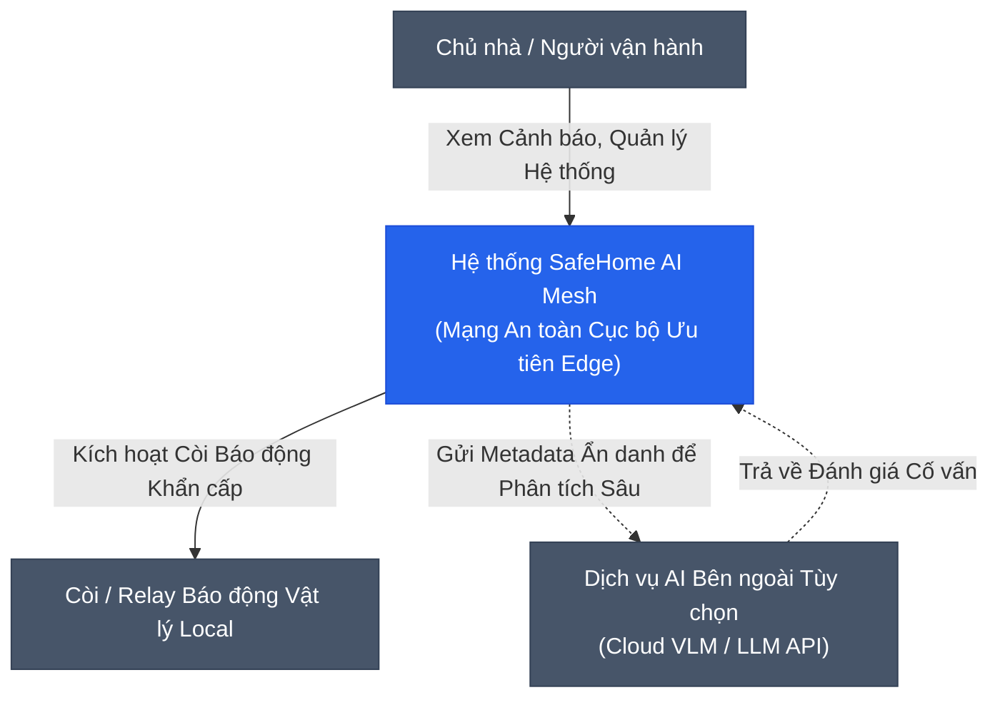
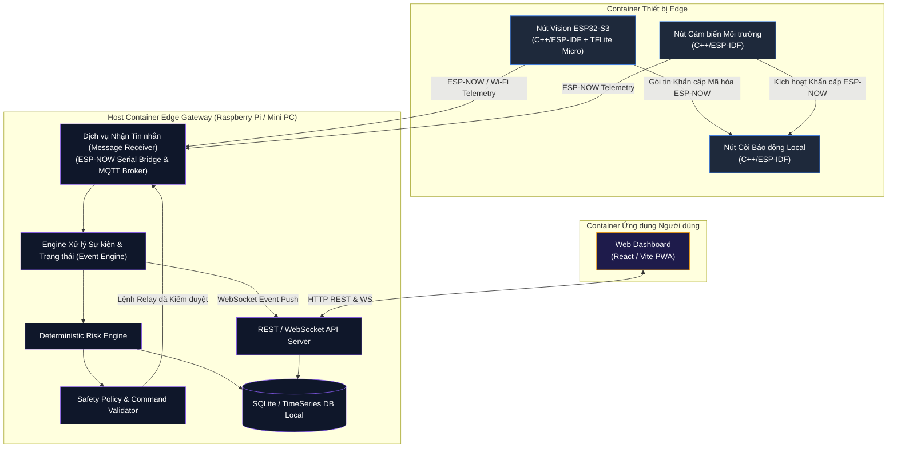
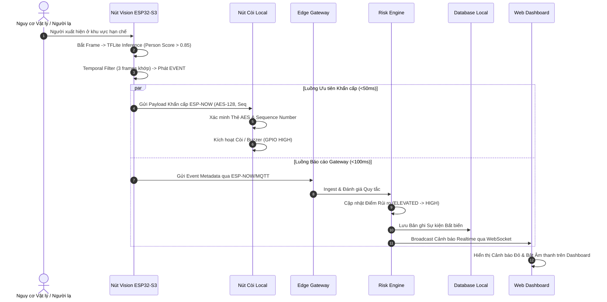

# 03 - Kiến trúc Hệ thống (System Architecture)

> **Trạng thái Tài liệu:** `[DECISION]` Đặc tả Kiến trúc Hệ thống Chính  
> **Tiêu chuẩn Mô hình hóa:** Mô hình C4 (Context, Container, Component, Deployment)  

---

## 1. Phân chia Chức năng Đa tầng (Multi-Layer Functional Breakdown)

Kiến trúc SafeHome AI Mesh được tổ chức thành 6 tầng chức năng độc lập, giảm thiểu phụ thuộc lẫn nhau:

```text
┌──────────────────────────────────────────────────────────────────────────┐
│ 6. Tầng Ứng dụng (Web Monitoring Dashboard, Mobile Alert UI)            │
├──────────────────────────────────────────────────────────────────────────┤
│ 5. Tầng Dữ liệu & Lưu trữ (TimescaleDB / SQLite, Event Store, Config DB) │
├──────────────────────────────────────────────────────────────────────────┤
│ 4. Tầng Xử lý Gateway (Event Normalizer, Risk Engine, Safety Policy)     │
├──────────────────────────────────────────────────────────────────────────┤
│ 3. Tầng Truyền thông (ESP-NOW Encrypted Fast-Path, MQTT / WebSockets)    │
├──────────────────────────────────────────────────────────────────────────┤
│ 2. Tầng Cảm biến & Edge Vision (ESP32-S3 Edge AI, PIR, Reed, Smoke Nodes)│
├──────────────────────────────────────────────────────────────────────────┤
│ 1. Tầng Phần cứng Vật lý (Vi điều khiển ESP32, Camera, Còi/Relay)       │
└──────────────────────────────────────────────────────────────────────────┘
```

---

## 2. Sơ đồ C4 Context Diagram (Mức 1)



---

## 3. Sơ đồ C4 Container Diagram (Mức 2)



---

## 4. Sơ đồ Tuần tự Hệ thống (Sequence Diagram): Luồng Khẩn cấp End-to-End



---

## 5. Tóm tắt Đánh đổi Kiến trúc & Hồ sơ ADR

1. **Edge Vision Độc lập vs. Stream Video Trực tiếp:**  
   * *Quyết định:* Suy luận MobileNet tại thiết bị phát ra metadata JSON sự kiện thay vì stream video 24/7.
   * *Đánh đổi:* Tiết kiệm băng thông mạng và bảo vệ quyền riêng tư, nhưng người dùng không xem được video 4K trực tiếp ngoại trừ khi có cảnh báo.
2. **Mạng ESP-NOW Mesh vs. Mạng Wi-Fi Tiêu chuẩn:**  
   * *Quyết định:* Dùng ESP-NOW cho kênh khẩn cấp, Wi-Fi cho telemetry.
   * *Đánh đổi:* Cần quản lý bảng địa chỉ MAC của peer trên từng nút ESP32, nhưng đảm bảo tín hiệu truyền dưới 50ms ngay cả khi router Wi-Fi bị sập.
