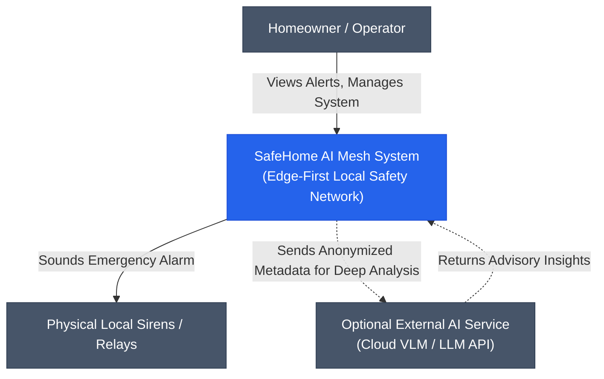
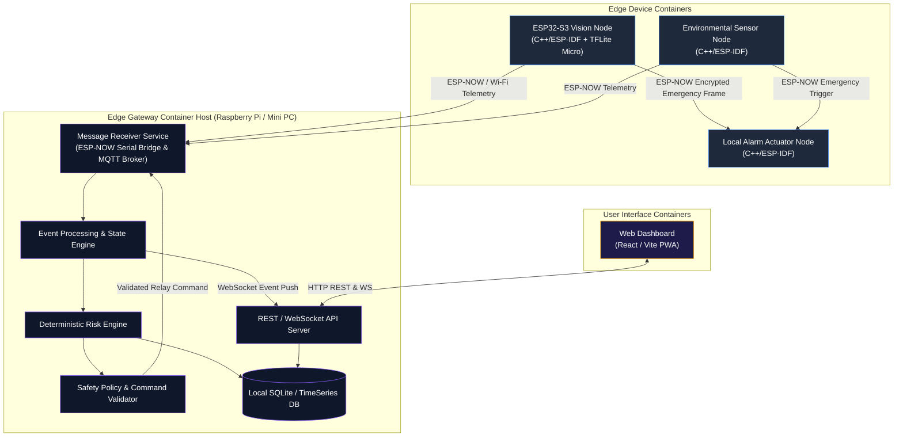
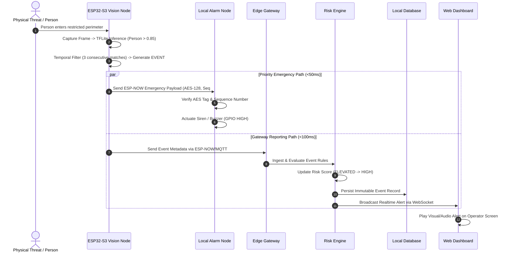

# 03 - System Architecture

> **Document Status:** `[DECISION]` Primary System Architecture Specification  
> **Modeling Standard:** C4 Model (Context, Container, Component, Deployment)  

---

## 1. Multi-Layer Functional Breakdown

The SafeHome AI Mesh architecture is organized into 6 distinct, decoupled functional layers:

```text
┌──────────────────────────────────────────────────────────────────────────┐
│ 6. Application Layer (Web Monitoring Dashboard, Mobile Alert UI)        │
├──────────────────────────────────────────────────────────────────────────┤
│ 5. Data & Storage Layer (TimescaleDB / SQLite, Event Store, Config DB)   │
├──────────────────────────────────────────────────────────────────────────┤
│ 4. Gateway Processing Layer (Event Normalizer, Risk Engine, Safety Policy)│
├──────────────────────────────────────────────────────────────────────────┤
│ 3. Communication Layer (ESP-NOW Encrypted Fast-Path, MQTT / WebSockets)  │
├──────────────────────────────────────────────────────────────────────────┤
│ 2. Edge Vision & Sensor Layer (ESP32-S3 Edge AI, PIR, Reed, Smoke Nodes)│
├──────────────────────────────────────────────────────────────────────────┤
│ 1. Physical Hardware Layer (ESP32 Silicon, Camera Sensors, Sirens/Relays)│
└──────────────────────────────────────────────────────────────────────────┘
```

---

## 2. C4 Context Diagram (Level 1)



---

## 3. C4 Container Diagram (Level 2)



---

## 4. System Sequence Diagram: End-to-End Emergency Flow



---

## 5. Architectural Trade-offs & ADR Summary

1. **Decoupled Edge Vision vs. Direct Video Streaming:**  
   * *Decision:* On-device MobileNet inference generating metadata JSON events instead of streaming 24/7 video.
   * *Trade-off:* Saves network bandwidth and preserves privacy, but prevents remote users from viewing live 4K streams unless an alert state is triggered.
2. **ESP-NOW Mesh vs. Standard Wi-Fi Infrastructure:**  
   * *Decision:* ESP-NOW for emergency path, Wi-Fi for telemetry.
   * *Trade-off:* Requires dedicated MAC peer management on ESP32 nodes, but guarantees sub-50ms transmission even if the home Wi-Fi access point crashes.
