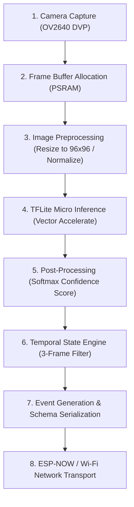

# 05 - ESP32-S3 Edge Device Specification

> **Document Status:** `[DECISION]` Embedded Hardware & Memory Blueprint  
> **Target Hardware:** ESP32-S3 WROOM N16R8 (16MB Quad SPI Flash, 8MB Octal SPI PSRAM)  

---

## 1. Silicon Architecture & Memory Layout

The ESP32-S3 dual-core LX7 microprocessor (up to 240 MHz) provides vector instructions (Vector Extension) optimized for AI inference acceleration. Efficient memory allocation between internal SRAM and external PSRAM is critical to prevent memory bus contention.

```text
       ┌─────────────────────────────────────────────────────────────┐
       │                 ESP32-S3 System Memory Map                  │
       ├──────────────────────────────┬──────────────────────────────┤
       │   Internal SRAM (512 KB)     │    External PSRAM (8 MB)     │
       ├──────────────────────────────┼──────────────────────────────┤
       │ • Wi-Fi Stack: ~70 KB        │ • Camera Double Buffer:      │
       │ • ESP-NOW Stack: ~35 KB      │   QVGA RGB888 (2x230KB=460KB)│
       │ • TFLite Tensor Arena: 150KB │ • TFLite Model Weights: 2.2MB│
       │ • System Heap & Stack: 150KB │ • JPEG Snapshot Buffer: 300KB│
       │ • Dynamic OS Alloc: ~107 KB  │ • Free PSRAM Heap: ~5.0 MB   │
       └──────────────────────────────┴──────────────────────────────┘
```

---

## 2. Camera Subsystem: JPEG vs RGB Allocation

The OV2640 camera module operates in two distinct image capture modes depending on the current system task:

| Mode | Format | Resolution | Memory Allocation | Primary Purpose | Architectural Tag |
| :--- | :--- | :--- | :--- | :--- | :--- |
| **Inference Mode** | RGB565 / Grayscale | QVGA ($320 \times 240$) | ~153 KB in PSRAM | Direct input to AI preprocessing tensor | `[DECISION]` |
| **Snapshot Mode** | JPEG Compressed | VGA ($640 \times 480$) | ~40–80 KB in PSRAM | Evidentiary image frame captured on alert trigger | `[DECISION]` |

---

## 3. On-Device Edge Pipeline Flow



---

## 4. Constraint Analysis & Verification Matrix

### CPU & Thermal Constraints
* Dual-Core Load Balancing:
  * **Core 0:** Reserved strictly for Wi-Fi / ESP-NOW protocol stack and network serial communications.
  * **Core 1:** Dedicated to Camera frame DMA capture, image scaling, and TFLite Micro inference execution.
* Inference Frequency: `[DECISION]` Target 5 FPS (200ms per frame loop).
* Thermal Management: `[VERIFY]` Prolonged 240MHz dual-core operation causes thermal rise. `[ASSUMPTION]` Metal heatsink required on ESP32-S3 chip shield inside enclosed casing.

### Power & Electrical Budget
* Active Inference + Wi-Fi TX: ~240mA – 310mA at 5V DC.
* Power Supply Unit (PSU) Requirement: Dedicated 5V / 2A micro-USB / Type-C adapter. `[MUST]` Include 1000uF decoupling capacitor across 5V/GND rails to absorb Wi-Fi RF transmit current spikes.

---

## 5. Explicit Verification Tags

* `[VERIFY]` Test Octal PSRAM bandwidth bottleneck when Core 0 (Wi-Fi) and Core 1 (DMA Camera) access PSRAM simultaneously.
* `[ASSUMPTION]` Ambient room lighting is sufficient for OV2640 sensor without requiring IR LED fill light in daytime scenarios.
* `[TBD]` Measure exact milliwatt power consumption during deep sleep state with PIR motion interrupt wakeup.
