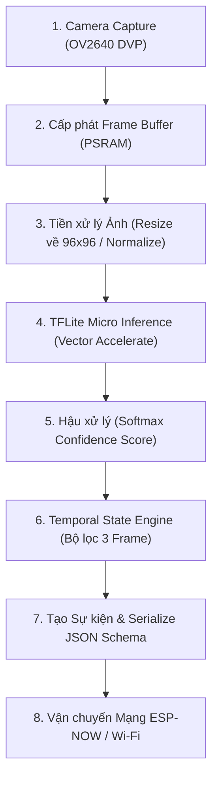

# 05 - Đặc tả Thiết bị Edge ESP32-S3 (ESP32-S3 Edge Device)

> **Trạng thái Tài liệu:** `[DECISION]` Blueprint Phần cứng & Bộ nhớ Nhúng  
> **Mục tiêu Phần cứng:** ESP32-S3 WROOM N16R8 (16MB Quad SPI Flash, 8MB Octal SPI PSRAM)  

---

## 1. Kiến trúc Chip Silicon & Bố trí Bộ nhớ (Memory Layout)

Vi xử lý lõi kép LX7 ESP32-S3 (tần số lên tới 240 MHz) cung cấp các tập lệnh vectơ (Vector Extension) được tối ưu hóa cho tăng tốc suy luận AI. Việc phân bổ bộ nhớ hiệu quả giữa Internal SRAM và External PSRAM là yếu tố sống còn để tránh tranh chấp bus bộ nhớ.

```text
       ┌─────────────────────────────────────────────────────────────┐
       │             Bản đồ Bộ nhớ Hệ thống ESP32-S3                 │
       ├──────────────────────────────┬──────────────────────────────┤
       │   Internal SRAM (512 KB)     │    External PSRAM (8 MB)     │
       ├──────────────────────────────┼──────────────────────────────┤
       │ • Wi-Fi Stack: ~70 KB        │ • Camera Double Buffer:      │
       │ • ESP-NOW Stack: ~35 KB      │   QVGA RGB888 (2x230KB=460KB)│
       │ • TFLite Tensor Arena: 150KB │ • TFLite Model Weights: 2.2MB│
       │ • System Heap & Stack: 150KB │ • JPEG Snapshot Buffer: 300KB│
       │ • Dynamic OS Alloc: ~107 KB  │ • Free PSRAM Heap: ~5.0 MB   │
       └──────────────────────────────┴──────────────────────────────┘
```

---

## 2. Phân hệ Camera: So sánh JPEG vs. RGB Allocation

Module camera OV2640 hoạt động ở hai chế độ bắt hình riêng biệt tùy theo nhiệm vụ hiện tại:

| Chế độ (Mode) | Định dạng | Độ phân giải | Cấp phát Bộ nhớ | Mục đích Chính | Nhãn Kiến trúc |
| :--- | :--- | :--- | :--- | :--- | :--- |
| **Inference Mode** | RGB565 / Grayscale | QVGA ($320 \times 240$) | ~153 KB trong PSRAM | Làm đầu vào trực tiếp cho tensor tiền xử lý AI | `[DECISION]` |
| **Snapshot Mode** | JPEG Compressed | VGA ($640 \times 480$) | ~40–80 KB trong PSRAM | Bắt khung hình bằng chứng khi có kích hoạt alert | `[DECISION]` |

---

## 3. Luồng Pipeline Edge trên Thiết bị



---

## 4. Phân tích Ràng buộc & Ma trận Kiểm chứng (Constraint Analysis)

### Ràng buộc CPU & Tản nhiệt (CPU & Thermal Constraints)
* Cân bằng Tải Lõi kép (Dual-Core Load Balancing):
  * **Core 0:** Dành riêng tuyệt đối cho luồng giao thức Wi-Fi / ESP-NOW và truyền thông serial.
  * **Core 1:** Dành riêng cho việc bắt frame camera DMA, resize ảnh và thực thi suy luận TFLite Micro.
* Tần suất Suy luận (Inference Frequency): `[DECISION]` Target 5 FPS (200ms mỗi vòng lặp frame).
* Quản lý Tản nhiệt: `[VERIFY]` Vi xử lý chạy liên tục 240MHz lõi kép gây tăng nhiệt. `[ASSUMPTION]` Cần tản nhiệt kim loại trên shield ESP32-S3 khi đóng vỏ hộp.

### Ngân sách Nguồn điện (Power & Electrical Budget)
* Dòng điện khi Active Inference + Wi-Fi TX: ~240mA – 310mA ở điện áp 5V DC.
* Yêu cầu Nguồn PSU: Adapter 5V / 2A Type-C dedicated. `[MUST]` Lắp tụ điện lọc nguồn 1000uF song song với chân 5V/GND để hấp thụ đỉnh dòng khi Wi-Fi phát sóng RF.

---

## 5. Nhãn Kiểm chứng Minh bạch (Explicit Verification Tags)

* `[VERIFY]` Kiểm tra điểm nghẽn băng thông Octal PSRAM khi Core 0 (Wi-Fi) và Core 1 (DMA Camera) truy cập PSRAM đồng thời.
* `[ASSUMPTION]` Ánh sáng phòng tự nhiên đủ cho cảm biến OV2640 hoạt động ban ngày mà không cần bật LED hồng ngoại trợ sáng.
* `[TBD]` Đo chính xác lượng tiêu thụ điện năng milliwatt ở chế độ deep sleep khi chờ ngắt chuyển động từ PIR.
