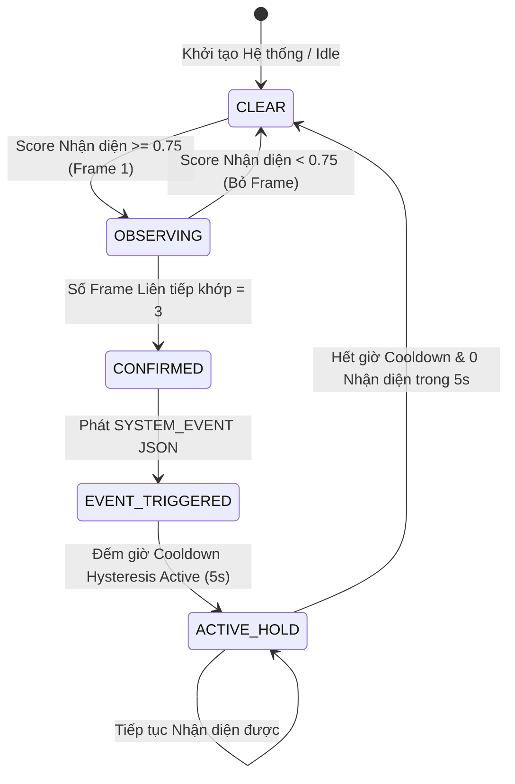

# 07 - Tạo Sự kiện & Temporal State Engine (Event Generation)

> **Trạng thái Tài liệu:** `[DECISION]` Đặc tả Pipeline Sự kiện & JSON Serialization  

---

## 1. Pipeline Tạo Sự kiện Chuẩn hóa (Formal Event Pipeline)

Để triệt tiêu các thông báo rác báo động giả, các suy luận thô theo từng frame được xử lý qua một state machine định tính trước khi đóng gói gửi qua mạng:



---

## 2. Tham số Bộ máy Temporal Engine

| Tên Tham số | Giá trị | Mục đích Phục vụ | Trạng thái Kiến trúc |
| :--- | :--- | :--- | :--- |
| `CONFIDENCE_THRESHOLD` | `0.75` | Ngón Softmax tối thiểu cho nhận diện 1 frame | `[DECISION]` |
| `CONSECUTIVE_FRAMES` | `3` | Số frame nhận diện dương tính liên tiếp bắt buộc ($N=3$) | `[DECISION]` |
| `COOLDOWN_WINDOW_MS` | `5000` | Thời gian chờ trước khi cho phép hạ trạng thái hoặc phát trùng | `[DECISION]` |
| `HYSTERESIS_MARGIN` | `0.15` | Ngưỡng hạ trạng thái là $0.75 - 0.15 = 0.60$ khi đang hold | `[DECISION]` |
| `HEARTBEAT_INTERVAL_MS`| `30000` | Tín hiệu ping duy trì khi trạng thái không đổi | `[DECISION]` |

---

## 3. Schema JSON Chuẩn hóa cho Sự kiện Hệ thống

Khi trạng thái chuyển sang `EVENT_TRIGGERED`, nút thiết bị tạo ra một payload JSON được định kiểu nghiêm ngặt:

```json
{
  "$schema": "https://json-schema.org/draft/2020-12/schema",
  "title": "SafeHomeSystemEvent",
  "type": "object",
  "properties": {
    "event_id": {
      "type": "string",
      "format": "uuid",
      "description": "Mã V4 UUID duy nhất tạo tại thiết bị để khử trùng lặp và đảm bảo tính idempotency"
    },
    "schema_version": {
      "type": "string",
      "enum": ["1.0.0"],
      "description": "Tag phiên bản schema để đảm bảo tương thích ngược"
    },
    "device_id": {
      "type": "string",
      "example": "ESP32CAM-ZONE1-FRONTDOOR",
      "description": "Định danh phần cứng duy nhất suy ra từ địa chỉ MAC"
    },
    "timestamp_ms": {
      "type": "integer",
      "description": "Thời gian Epoch tính bằng miligiây tại thời điểm kích hoạt"
    },
    "sequence_number": {
      "type": "integer",
      "minimum": 1,
      "description": "Bộ đếm tăng dần liên tục theo thiết bị để chống replay & sắp xếp thứ tự"
    },
    "event_type": {
      "type": "string",
      "enum": [
        "HUMAN_DETECTION",
        "SMOKE_DETECTION",
        "GAS_LEAK_DETECTION",
        "PERIMETER_BREACH",
        "TAMPER_ALERT",
        "DEVICE_HEARTBEAT"
      ]
    },
    "severity": {
      "type": "string",
      "enum": ["INFO", "WARNING", "CRITICAL", "EMERGENCY"]
    },
    "confidence": {
      "type": "number",
      "minimum": 0.0,
      "maximum": 1.0,
      "description": "Điểm tin cậy đã lọc qua temporal filter"
    },
    "location_zone": {
      "type": "string",
      "example": "PERIMETER_NORTH"
    },
    "metadata": {
      "type": "object",
      "properties": {
        "consecutive_frames": { "type": "integer", "example": 3 },
        "inference_latency_ms": { "type": "integer", "example": 135 },
        "battery_voltage": { "type": "number", "example": 4.12 }
      },
      "additionalProperties": true
    }
  },
  "required": [
    "event_id",
    "schema_version",
    "device_id",
    "timestamp_ms",
    "sequence_number",
    "event_type",
    "severity",
    "confidence",
    "location_zone"
  ]
}
```

---

## 4. Quy tắc Idempotency & Deduplication

1. **Khử Trùng lặp tại Gateway Ingest:** Edge Gateway duy trì một bộ nhớ đệm Sliding Window LRU Cache lưu các chuỗi `event_id` (TTL = 60 giây). Bất kỳ `event_id` trùng lặp nào nhận được trong cửa sổ này sẽ bị hủy bỏ lặng lẽ kèm log.
2. **Kiểm tra Thứ tự Sequence Number:** Sự lệch thứ tự sequence number theo từng `device_id` được ghi log để phát hiện hiện tượng mất gói tin trên không gian không dây.
