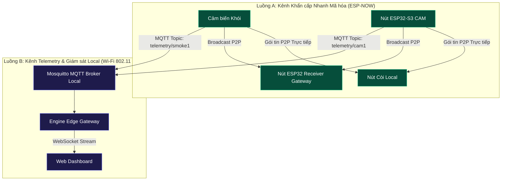

# 08 - Kiến trúc Mạng Hybrid (Network Architecture)

> **Trạng thái Tài liệu:** `[DECISION]` Đặc tả Lựa chọn Giao thức & Phân kênh Mạng  

---

## 1. Bảng Đánh giá & Ma trận Quyết định Giao thức Mạng

Để đạt được phản ứng khẩn cấp dưới 1 giây song song với việc giám sát dashboard mượt mà, hệ thống áp dụng **Kiến trúc Truyền thông Hybrid**, khớp đặc tính của từng giao thức với use case cụ thể:

| Giao thức | Độ trễ (Latency) | Phụ thuộc Router | Overhead | Kích thước Payload | Use Case Chính trong SafeHome | Quyết định Kiến trúc |
| :--- | :--- | :--- | :--- | :--- | :--- | :--- |
| **ESP-NOW** | $<15\text{ ms}$ | **KHÔNG** (Peer-to-Peer MAC) | Cực thấp (Max 250B) | $<250$ Bytes | Cảnh báo Khẩn cấp & Cảm biến kích hoạt | `[DECISION]` Kênh Khẩn cấp Chính |
| **MQTT** | $50-150\text{ ms}$ | CÓ (Local AP) | Thấp (Binary Header) | $1-64$ KB | Telemetry Cảm biến & Heartbeats | `[DECISION]` Kênh Telemetry Tiêu chuẩn |
| **WebSocket** | $<30\text{ ms}$ | CÓ (Local AP) | Thấp (Post-Handshake) | Linh hoạt | Stream realtime Gateway $\leftrightarrow$ UI Dashboard | `[DECISION]` Kênh Streaming UI Realtime |
| **HTTP/REST**| $100-300\text{ ms}$| CÓ (Local AP) | Cao (HTTP Headers) | Linh hoạt | Cấu hình, Truy vấn Log, Xác thực Auth | `[DECISION]` Kênh API Quản lý |
| **UDP** | $<20\text{ ms}$ | CÓ (Local AP) | Tối thiểu | Linh hoạt | Stream Snapshot Ảnh tức thì (Tùy chọn) | `[EXPERIMENT]` Luồng Video Burst |
| **TCP** | $50-200\text{ ms}$ | CÓ (Local AP) | Vừa phải | Linh hoạt | Đồng bộ CSDL khối lượng lớn | `[DECISION]` Hệ thống Logging |

---

## 2. Sơ đồ Mạng Phân luồng Kép (Hybrid Dual-Path Topography)

---

## 3. Chiến lược Khóa Kênh Wi-Fi & Đồng tồn tại (Coexistence Strategy)

1. **Khóa Cố định Kênh RF (RF Channel Lock):** Tất cả các nút ESP32 sử dụng đồng thời ESP-NOW và Wi-Fi BẮT BUỘC phải khóa cứng chip radio ở một kênh Wi-Fi 2.4GHz cố định (ví dụ: **Channel 6, 2437 MHz**). `[DECISION]`
   * *Lý do:* ESP-NOW yêu cầu radio phát và radio nhận phải vận hành trên cùng một kênh RF giống hệt nhau. Nếu kênh Wi-Fi tự động nhảy, các gói tin ESP-NOW sẽ bị rơi.
2. **Quy tắc Ưu tiên Ngắt:** Khi một nút camera ESP32 đang stream telemetry MQTT qua Wi-Fi tiêu chuẩn, stack giao thức ESP-NOW vẫn duy trì quyền ưu tiên ngắt RF pre-allocated để lập tức chiếm dụng phần cứng phát gói tin khẩn cấp ngay khi có sự cố.
