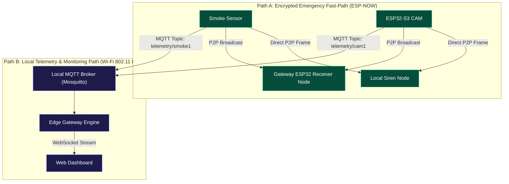

# 08 - Hybrid Network Architecture

> **Document Status:** `[DECISION]` Protocol Selection & Channel Architecture  

---

## 1. Network Protocol Evaluation & Decision Matrix

To achieve sub-second emergency response alongside rich dashboard monitoring, the system adopts a **Hybrid Communication Architecture**, matching protocol characteristics to specific operational use cases:

| Protocol | Latency | Router Dependency | Overhead | Payload Size | Primary Use Case in SafeHome | Architectural Decision |
| :--- | :--- | :--- | :--- | :--- | :--- | :--- |
| **ESP-NOW** | $<15\text{ ms}$ | **NO** (Peer-to-Peer MAC) | Ultra-Low (250B max) | $<250$ Bytes | Emergency Alarms & Sensor Triggers | `[DECISION]` Primary Emergency Path |
| **MQTT** | $50-150\text{ ms}$ | YES (Local AP) | Low (Binary Header) | $1-64$ KB | General Sensor Telemetry & Heartbeats | `[DECISION]` Standard Telemetry Path |
| **WebSocket** | $<30\text{ ms}$ | YES (Local AP) | Low (Post-Handshake) | Flexible | Live Gateway $\leftrightarrow$ UI Dashboard Feed | `[DECISION]` Realtime UI Streaming |
| **HTTP/REST**| $100-300\text{ ms}$| YES (Local AP) | High (HTTP Headers) | Flexible | Configuration, Historical Logs, Auth | `[DECISION]` Management API Path |
| **UDP** | $<20\text{ ms}$ | YES (Local AP) | Minimal | Flexible | Video Snapshot Frame Streaming (Opt) | `[EXPERIMENT]` Video Burst Stream |
| **TCP** | $50-200\text{ ms}$ | YES (Local AP) | Moderate | Flexible | Bulk Database Sync | `[DECISION]` System Logging |

---

## 2. Hybrid Dual-Path Network Topography

---

## 3. Wi-Fi Channel Selection & Coexistence Strategy

1. **RF Channel Lock:** All ESP32 nodes using both ESP-NOW and Wi-Fi MUST lock their Wi-Fi radio to a fixed 2.4GHz Wi-Fi channel (e.g., **Channel 6, 2437 MHz**). `[DECISION]`
   * *Rationale:* ESP-NOW requires transmitter and receiver radios to operate on identical RF channels. If Wi-Fi channel hops automatically, ESP-NOW frames will be dropped.
2. **Coexistence Rules:** When an ESP32 camera node streams MQTT telemetry over standard Wi-Fi, the ESP-NOW protocol stack retains pre-allocated RF interrupt priority to preempt outgoing MQTT TCP packets immediately upon an emergency trigger.
