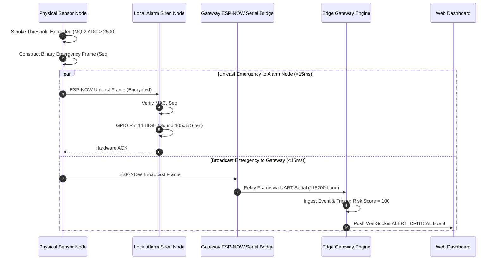

# 09 - ESP-NOW Emergency Fast-Path Specification

> **Document Status:** `[DECISION]` Low-Latency Protocol Specification  
> **Standard:** ESP-NOW IEEE 802.11 Vendor-Specific Action Frames  

---

## 1. ESP-NOW Frame Binary Format (250 Bytes Max)

To achieve maximum transfer speed and hardware decoding efficiency, emergency messages use a packed binary C-struct framing layout:

```c
// Binary Structure (Packed, 64 Bytes Total)
typedef struct __attribute__((__packed__)) {
    uint8_t  magic_header[2];    // 0x53, 0x48 ('S', 'H' - SafeHome)
    uint8_t  version;            // Protocol version (0x01)
    uint8_t  msg_type;           // 0x01: EMERGENCY, 0x02: ACK, 0x03: HEARTBEAT
    uint8_t  sender_mac[6];      // Hardware MAC address of origin device
    uint32_t sequence_number;    // Monotonically increasing anti-replay counter
    uint32_t timestamp_sec;      // Unix timestamp (or local uptime ticks if offline)
    uint8_t  event_type_id;      // 0x10: Smoke, 0x11: Gas, 0x20: Human Incursion
    uint8_t  severity_level;     // 0x01: INFO, 0x02: WARN, 0x03: CRITICAL, 0x04: EMERGENCY
    uint16_t raw_confidence;     // Fixed-point float (0-10000 = 0.00% to 100.00%)
    uint8_t  payload_length;     // Length of optional metadata payload
    uint8_t  metadata[24];       // Optional zone / sensor diagnostic payload
    uint8_t  aes_mac_tag[16];    // AES-128-CBC / GCM authentication tag
} esp_now_emergency_frame_t;
```

---

## 2. Peer MAC Management & Device Provisioning

1. **Pairing Mode (Out-of-Band / Direct Button):**
   * New sensor nodes enter Provisioning Mode by holding a physical button for 5s.
   * Gateway broadcasts an encrypted `PAIRING_OFFER` frame over ESP-NOW.
   * Device and Gateway exchange MAC addresses and negotiate a shared 16-byte Primary Master Key (PMK) and Local Master Key (LMK).
2. **Peer Table Capacity:** ESP32 supports up to 20 registered ESP-NOW paired peers simultaneously. Gateway uses 1 designated ESP-NOW bridge chip dedicated exclusively to MAC peer management.

---

## 3. Cryptographic Security & Anti-Replay Protection

* **Symmetric Encryption:** All ESP-NOW emergency payloads are encrypted using AES-128 with LMK key.
* **Anti-Replay Window:**
  * Every device maintains an internal `uint32_t sequence_number`, incremented on every transmission.
  * Receiver drops any incoming frame where `incoming_seq <= last_verified_seq` for that sender MAC.

---

## 4. Transmission Reliability: ACK, Retry & Timeout

```text
  Sender Node                              Receiver (Alarm Node / Gateway)
      │                                                │
      │── Send ESP-NOW Frame (Req ACK) ───────────────>│
      │                                                │ [Decrypt & Validate Seq#]
      │                                                │ [Sound Local Siren]
      │<── Immediate Hardware ACK (< 2ms) ─────────────│
      │                                                │
  [No ACK Received within 15ms]                        │
      │                                                │
      │── Retry #1 (Random Jitter 2-5ms) ─────────────>│
      │── Retry #2 (Random Jitter 2-5ms) ─────────────>│
      │                                                │
```

* **Max Retries:** 3 hardware retries handled automatically by ESP-NOW driver.
* **Failure Fallback:** If Gateway ACK fails, node continues direct unicast transmission to the standalone Local Alarm Siren Node MAC.

---

## 5. End-to-End Emergency Sequence Diagram


