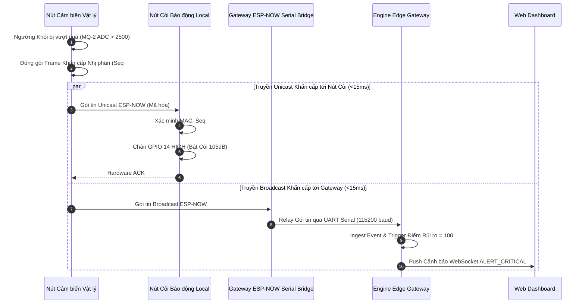

# 09 - Đặc tả Kênh Khẩn cấp ESP-NOW (ESP-NOW Emergency Path)

> **Trạng thái Tài liệu:** `[DECISION]` Đặc tả Giao thức Độ trễ Thấp  
> **Tiêu chuẩn:** ESP-NOW IEEE 802.11 Vendor-Specific Action Frames  

---

## 1. Định dạng Frame Nhị phân ESP-NOW (Tối đa 250 Bytes)

Để đạt tốc độ truyền tối đa và hiệu quả giải mã bằng phần cứng, các tin nhắn khẩn cấp sử dụng cấu trúc packed binary C-struct:

```c
// Binary Structure (Packed, 64 Bytes Total)
typedef struct __attribute__((__packed__)) {
    uint8_t  magic_header[2];    // 0x53, 0x48 ('S', 'H' - SafeHome)
    uint8_t  version;            // Phiên bản giao thức (0x01)
    uint8_t  msg_type;           // 0x01: EMERGENCY, 0x02: ACK, 0x03: HEARTBEAT
    uint8_t  sender_mac[6];      // Địa chỉ MAC phần cứng của thiết bị gửi
    uint32_t sequence_number;    // Bộ đếm tăng liên tục chống tấn công replay
    uint32_t timestamp_sec;      // Thời gian Unix timestamp (hoặc uptime ticks nếu offline)
    uint8_t  event_type_id;      // 0x10: Khói, 0x11: Gas, 0x20: Xâm nhập người
    uint8_t  severity_level;     // 0x01: INFO, 0x02: WARN, 0x03: CRITICAL, 0x04: EMERGENCY
    uint16_t raw_confidence;     // Điểm số dấy phẩy cố định (0-10000 = 0.00% đến 100.00%)
    uint8_t  payload_length;     // Độ dài phần metadata bổ sung
    uint8_t  metadata[24];       // Payload phụ về khu vực / chẩn đoán cảm biến
    uint8_t  aes_mac_tag[16];    // Thẻ xác thực mã hóa AES-128-CBC / GCM
} esp_now_emergency_frame_t;
```

---

## 2. Quản lý Địa chỉ MAC Peer & Provisioning Thiết bị

1. **Chế độ Ghép nối Pairing (Out-of-Band / Physical Button):**
   * Nút cảm biến mới vào Chế độ Provisioning bằng cách giữ nút nhấn vật lý trong 5s.
   * Gateway phát broadcast một gói tin `PAIRING_OFFER` đã mã hóa qua ESP-NOW.
   * Thiết bị và Gateway trao đổi địa chỉ MAC và đàm phán một khóa chung Primary Master Key (PMK) và Local Master Key (LMK) 16-byte.
2. **Sức chứa Bảng Peer:** Chip ESP32 hỗ trợ tối đa 20 peer ghép nối ESP-NOW đồng thời. Gateway sử dụng 1 chip ESP32 bridge riêng dành riêng cho việc quản lý các MAC peer.

---

## 3. An ninh Mã hóa & Chống Tấn công Bắt lại (Anti-Replay)

* **Mã hóa Đối xứng (Symmetric Encryption):** Toàn bộ payload khẩn cấp ESP-NOW được mã hóa bằng AES-128 với khóa LMK.
* **Cửa sổ Chống Bắt lại (Anti-Replay Window):**
  * Mỗi thiết bị duy trì một bộ đếm `uint32_t sequence_number` tăng lên sau mỗi lượt phát.
  * Thiết bị nhận sẽ tự động hủy bỏ bất kỳ gói tin nào có `incoming_seq <= last_verified_seq` tương ứng với địa chỉ MAC của bên gửi.

---

## 4. Độ tin cậy Truyền dẫn: ACK, Retry & Timeout

```text
  Nút Gửi (Sender Node)                    Nút Nhận (Còi Báo động / Gateway)
      │                                                │
      │── Gửi Frame ESP-NOW (Req ACK) ────────────────>│
      │                                                │ [Giải mã & Kiểm tra Seq#]
      │                                                │ [Kích hoạt Còi Local]
      │<── Hardware ACK Tức thì (< 2ms) ───────────────│
      │                                                │
  [Không nhận được ACK trong 15ms]                     │
      │                                                │
      │── Gửi lại Retry #1 (Random Jitter 2-5ms) ─────>│
      │── Gửi lại Retry #2 (Random Jitter 2-5ms) ─────>│
      │                                                │
```

* **Số lần Retry Tối đa:** 3 lần thử lại bằng phần cứng được xử lý tự động bởi driver ESP-NOW.
* **Dự phòng Thất bại (Fallback):** Nếu Gateway ACK thất bại, nút cảm biến tiếp tục truyền unicast tới địa chỉ MAC của Nút Còi Báo động Local độc lập.

---

## 5. Sơ đồ Tuần tự Luồng Khẩn cấp End-to-End


