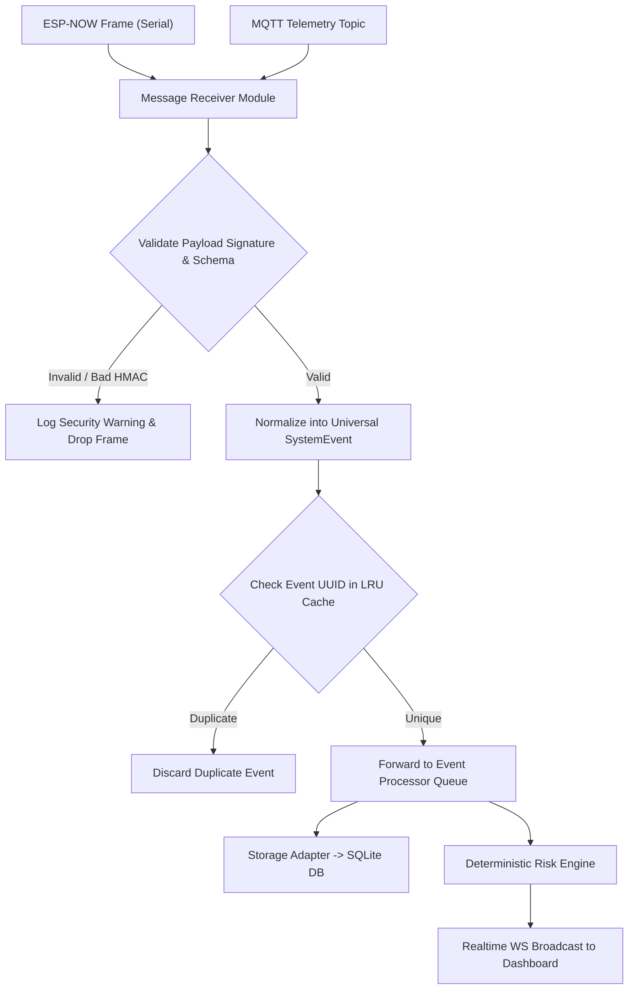

# 10 - Edge Gateway Subsystem Specification

> **Document Status:** `[DECISION]` Gateway Software Architecture  
> **Deployment Target:** Raspberry Pi 4B (4GB RAM) / Intel N100 Mini PC running Ubuntu 22.04 LTS  

---

## 1. Modular Subsystem Architecture

The Edge Gateway is designed as an isolated, containerized application with 8 core micro-modules:

```text
┌─────────────────────────────────────────────────────────────────────────────┐
│                            Edge Gateway System                              │
├──────────────────────┬──────────────────────┬───────────────────────────────┤
│ 1. Device Manager    │ 2. Message Receiver  │ 3. Event Processing Engine    │
│  (MAC/IP Registry)   (MQTT / Serial Bridge)  (Validation & Normalization)   │
├──────────────────────┼──────────────────────┼───────────────────────────────┤
│ 4. Deterministic     │ 5. Storage Adapter   │ 6. API Server & Auth          │
│    Risk Engine       │  (SQLite/TimescaleDB)|  (REST HTTP Endpoints)        │
├──────────────────────┼──────────────────────┼───────────────────────────────┤
│ 7. Realtime Server   │ 8. Notification Mgr  │ 9. Safety Policy Firewall     │
│  (WebSocket Push)    │  (Local Siren/Push)  │  (ACTUATOR VALIDATION LAYER)  │
└──────────────────────┴──────────────────────┴───────────────────────────────┘
```

---

## 2. Ingest, Validation & Normalization Pipeline



---

## 3. Resilience & Recovery Capabilities

1. **Automatic Startup Recovery:** Gateway operates under `systemd` process supervision with auto-restart on panic/crash within 2 seconds.
2. **Offline Buffer Queuing:** If the local database locks or disk writes fail, incoming normalized events are temporarily appended to an in-memory Ring Buffer (capacity: 10,000 events).
3. **Hardware Watchdog:** Raspberry Pi hardware watchdog timer enabled (`bcm2835_wdt`) to trigger physical reboot if system locks up completely for $>15$ seconds.
