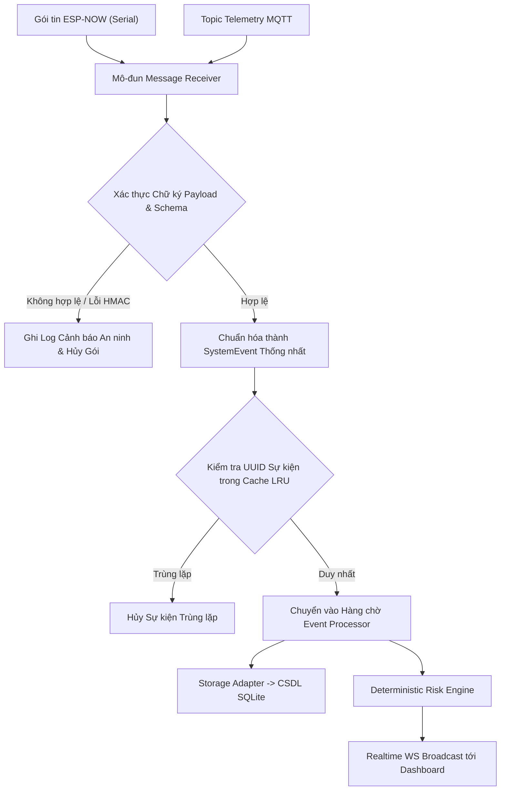

# 10 - Đặc tả Phân hệ Edge Gateway (Edge Gateway Subsystem)

> **Trạng thái Tài liệu:** `[DECISION]` Kiến trúc Phần mềm Gateway  
> **Mục tiêu Triển khai:** Raspberry Pi 4B (4GB RAM) / Intel N100 Mini PC chạy Ubuntu 22.04 LTS  

---

## 1. Kiến trúc Phân hệ Mô-đun (Modular Subsystem Architecture)

Edge Gateway được thiết kế dạng ứng dụng container hóa mô-đun hóa cách ly gồm 8 vi mô-đun cốt lõi:

```text
┌─────────────────────────────────────────────────────────────────────────────┐
│                           Hệ thống Edge Gateway                             │
├──────────────────────┬──────────────────────┬───────────────────────────────┤
│ 1. Device Manager    │ 2. Message Receiver  │ 3. Event Processing Engine    │
│  (Quản lý MAC/IP)    │  (MQTT / Serial)     │  (Xác thực & Chuẩn hóa)       │
├──────────────────────┼──────────────────────┼───────────────────────────────┤
│ 4. Deterministic     │ 5. Storage Adapter   │ 6. API Server & Auth          │
│    Risk Engine       │  (SQLite/TimescaleDB)|  (Các Endpoint REST HTTP)     │
├──────────────────────┼──────────────────────┼───────────────────────────────┤
│ 7. Realtime Server   │ 8. Notification Mgr  │ 9. Safety Policy Firewall     │
│  (WebSocket Push)    │  (Còi Local/Push)    │  (TẦNG KIỂM DUYỆT LỆNH KÍCH HOẠT)│
└──────────────────────┴──────────────────────┴───────────────────────────────┘
```

---

## 2. Pipeline Ingest, Xác thực & Chuẩn hóa (Ingest Pipeline)



---

## 3. Khả năng Kháng lỗi & Phục hồi (Resilience & Recovery)

1. **Tự động Khôi phục khi Khởi động:** Gateway vận hành dưới sự giám sát tiến trình của `systemd`, tự động restart khi gặp lỗi panic/crash trong vòng 2 giây.
2. **Hàng chờ Bộ đệm Offline (Offline Buffer Queuing):** Nếu CSDL local bị khóa hoặc lỗi ghi đĩa, các sự kiện đã chuẩn hóa sẽ tạm thời được đẩy vào một Ring Buffer bộ nhớ in-memory (sức chứa: 10,000 sự kiện).
3. **Hardware Watchdog:** Bật bộ đếm thời gian hardware watchdog trên Raspberry Pi (`bcm2835_wdt`) để kích hoạt reboot phần cứng nếu hệ thống bị treo cứng quá $>15$ giây.
