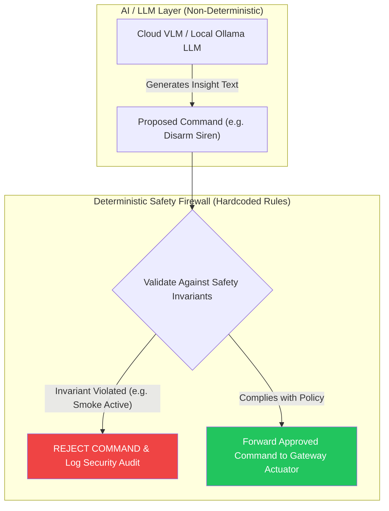

# 12 - Deterministic Risk Engine & Safety Policy

> **Document Status:** `[DECISION]` Risk Evaluation & Safety Override Specification  
> **Core Architectural Principle:** Safety over Intelligence (Deterministic Rules > AI Output)  

---

## 1. Risk Level Definitions

The Risk Engine continuously calculates an integer **System Risk Score** ($0 \le S \le 100$) and maps it to 4 discrete threat levels:

| Risk Level | Score Range | System State & Default Action |
| :--- | :--- | :--- |
| **NORMAL** | $0 \le S \le 24$ | System idle, green indicator, periodic heartbeats |
| **ELEVATED** | $25 \le S \le 49$ | Yellow status, enable fast camera sampling, push UI notice |
| **HIGH** | $50 \le S \le 74$ | Orange alert, activate local chime, ready emergency sirens |
| **CRITICAL** | $75 \le S \le 100$ | Red alert, actuate 105dB local sirens, lock relays, push priority emergency UI alert |

---

## 2. Multi-Event Correlation Rule Engine `[DESIGN EXAMPLE]`

Risk score is computed deterministically using weighted event correlation over a rolling 30-second window:

$$\text{Risk Score } S = \min\left(100, \sum_{i=1}^{K} w_i \times C_i + S_{\text{context}}\right)$$

Where $w_i$ is event weight, $C_i$ is confidence, and $S_{\text{context}}$ is time-of-day offset.

```text
Correlation Matrix Table (Baseline Rules):

1. SINGLE EVENT: PIR Motion in Yard (Confidence 0.80)
   Score Impact: +20 points -> Total: 20 (NORMAL)

2. CORRELATED EVENT: PIR Motion (Yard) + Person Detected by ESP32 CAM (Confidence 0.90) within 15s
   Score Impact: +20 (PIR) + +45 (Vision) = 65 points -> Total: 65 (HIGH)

3. CRITICAL SINGLE EVENT: Smoke Sensor Exceeded Threshold (Confidence 1.0)
   Score Impact: Direct Override -> Total: 100 (CRITICAL)

4. TIME-OF-DAY CONTEXT: Door Reed Switch Open between 01:00 AM - 05:00 AM
   Score Impact: +35 points (Context Boost)
```

---

## 3. Strict Decoupling of AI / LLM Advisory Layer



### Safety Invariants (Non-Bypassable Rules)
1. **INVARIANT-01:** No command from any software API (including LLMs) can disable the physical smoke siren while smoke sensor reading $> 2000\text{ ADC}$.
2. **INVARIANT-02:** Door unlock actuation requires explicit manual 2-Factor authentication pin from human UI user when Risk Level is $\ge\text{HIGH}$.

---

## 4. De-escalation & Hysteresis Rules

To avoid rapid oscillating alert states:
* System remains locked in `HIGH` or `CRITICAL` state for at least **60 seconds** after all sensor triggers return to clear.
* De-escalation steps down monotonically (`CRITICAL` $\rightarrow$ `HIGH` $\rightarrow$ `ELEVATED` $\rightarrow$ `NORMAL`) at 30-second intervals.
