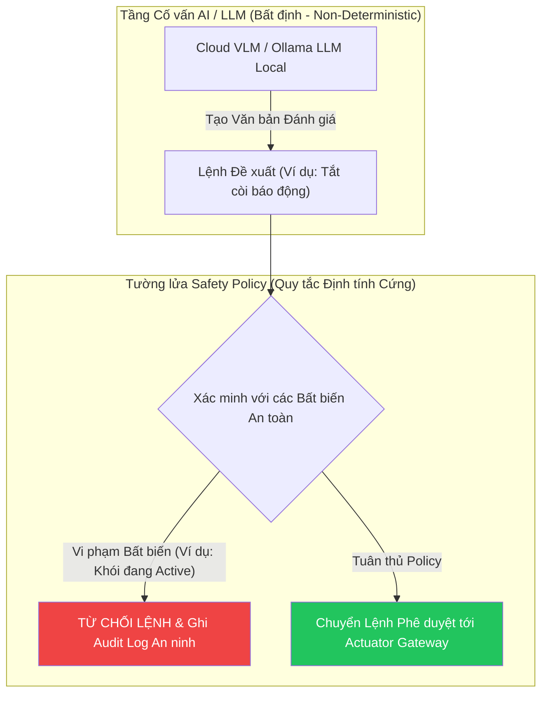

# 12 - Deterministic Risk Engine & Safety Policy

> **Trạng thái Tài liệu:** `[DECISION]` Đặc tả Đánh giá Rủi ro & Ghi đè An toàn  
> **Nguyên tắc Kiến trúc Cốt lõi:** Safety over Intelligence (Quy tắc Định tính > Đầu ra AI)  

---

## 1. Định nghĩa Các Cấp độ Rủi ro (Risk Levels)

Risk Engine liên tục tính toán **Điểm Rủi ro Hệ thống (System Risk Score)** dạng số nguyên ($0 \le S \le 100$) và ánh xạ thành 4 cấp độ đe dọa:

| Cấp độ Rủi ro | Khoảng Điểm | Trạng thái Hệ thống & Hành động Mặc định |
| :--- | :--- | :--- |
| **NORMAL** | $0 \le S \le 24$ | Hệ thống idle, đèn xanh, phát heartbeat định kỳ |
| **ELEVATED** | $25 \le S \le 49$ | Trạng thái vàng, tăng tần suất lấy mẫu camera, push thông báo UI |
| **HIGH** | $50 \le S \le 74$ | Cảnh báo cam, bật chuông chime local, sẵn sàng phát còi khẩn cấp |
| **CRITICAL** | $75 \le S \le 100$ | Cảnh báo đỏ, bật còi báo động local 105dB, khóa relay, push alert đỏ khẩn cấp |

---

## 2. Rule Engine Gom nhóm Đa Sự kiện (Multi-Event Correlation) `[VÍ DỤ THIẾT KẾ]`

Điểm rủi ro được tính toán định tính bằng công thức gom nhóm sự kiện có trọng số trong cửa sổ 30 giây:

$$\text{Điểm Rủi ro } S = \min\left(100, \sum_{i=1}^{K} w_i \times C_i + S_{\text{context}}\right)$$

Trong đó $w_i$ là trọng số sự kiện, $C_i$ là điểm tin cậy, và $S_{\text{context}}$ là hệ số điều chỉnh theo thời gian trong ngày.

```text
Bảng Ma trận Gom nhóm Sự kiện (Quy tắc Cơ sở):

1. SỰ KIỆN ĐƠN: PIR Chuyển động ở Sân (Độ tin cậy 0.80)
   Điểm Tăng: +20 điểm -> Tổng: 20 (NORMAL)

2. SỰ KIỆN KẾT HỢP: PIR Chuyển động (Sân) + Phát hiện Người qua ESP32 CAM (Độ tin cậy 0.90) trong 15s
   Điểm Tăng: +20 (PIR) + +45 (Vision) = 65 điểm -> Tổng: 65 (HIGH)

3. SỰ KIỆN KHẨN CẤP ĐƠN: Cảm biến Khói vượt ngưỡng (Độ tin cậy 1.0)
   Điểm Tăng: Ghi đè Trực tiếp -> Tổng: 100 (CRITICAL)

4. BỐI CẢNH THỜI GIAN: Công tắc Cửa mở trong khoảng 01:00 AM - 05:00 AM
   Điểm Tăng: +35 điểm (Cộng thêm bối cảnh đêm)
```

---

## 3. Cô lập Tuyệt đối Tầng AI / LLM Advisory



### Các Bất biến An toàn Không thể Bỏ qua (Safety Invariants)
1. **INVARIANT-01:** Không có bất kỳ lệnh nào từ phần mềm API (bao gồm cả LLM) được phép tắt còi báo động khẩn cấp khi cảm biến khói vẫn đo được giá trị $> 2000\text{ ADC}$.
2. **INVARIANT-02:** Lệnh mở khóa cửa kích hoạt yêu cầu xác thực 2 lớp thủ công bằng mã PIN từ người dùng trên giao diện UI khi Cấp độ Rủi ro đang ở mức $\ge\text{HIGH}$.

---

## 4. Quy tắc Hạ cấp Rủi ro & Trễ Hysteresis

Để tránh hiện tượng dao động bật/tắt trạng thái cảnh báo liên tục:
* Hệ thống giữ nguyên trạng thái `HIGH` hoặc `CRITICAL` trong ít nhất **60 giây** sau khi tất cả các cảm biến kích hoạt đã trở về bình thường.
* Việc hạ cấp rủi ro diễn ra đơn điệu từng bước (`CRITICAL` $\rightarrow$ `HIGH` $\rightarrow$ `ELEVATED` $\rightarrow$ `NORMAL`) theo các khoảng thời gian 30 giây.
