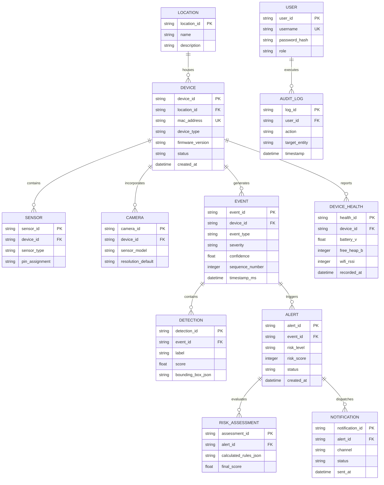

# 13 - Mô hình Dữ liệu & Đặc tả Schema (Data Model)

> **Trạng thái Tài liệu:** `[DECISION]` Blueprint Cơ sở Dữ liệu Quan hệ  
> **CSDL Mục tiêu:** SQLite (Embedded Edge) / PostgreSQL kết hợp TimescaleDB extension  

---

## 1. Sơ đồ Quan thể Thực thể (ERD - Entity-Relationship Diagram)

---

## 2. Đặc tả Bảng & Chỉ mục (Tables & Indexes)

### 2.1 Bảng: `events`
* Primary Key: `event_id` (TEXT / UUID)
* Foreign Key: `device_id` $\rightarrow$ `devices(device_id)`
* Các trường (Fields):
  * `event_id` TEXT NOT NULL PRIMARY KEY
  * `device_id` TEXT NOT NULL
  * `event_type` TEXT NOT NULL
  * `severity` TEXT NOT NULL
  * `confidence` REAL NOT NULL
  * `sequence_number` INTEGER NOT NULL
  * `timestamp_ms` TIMESTAMP NOT NULL
* Chỉ mục (Indexes):
  * `idx_events_device_time` ON (`device_id`, `timestamp_ms` DESC)
  * `idx_events_type_sev` ON (`event_type`, `severity`)

### 2.2 Bảng: `alerts`
* Primary Key: `alert_id` (TEXT / UUID)
* Foreign Key: `event_id` $\rightarrow$ `events(event_id)`
* Các trường (Fields):
  * `alert_id` TEXT NOT NULL PRIMARY KEY
  * `event_id` TEXT NOT NULL
  * `risk_level` TEXT NOT NULL
  * `risk_score` INTEGER NOT NULL
  * `status` TEXT NOT NULL -- ('ACTIVE', 'ACKNOWLEDGED', 'RESOLVED')
  * `created_at` TIMESTAMP NOT NULL DEFAULT CURRENT_TIMESTAMP
* Chỉ mục (Indexes):
  * `idx_alerts_status_created` ON (`status`, `created_at` DESC)
