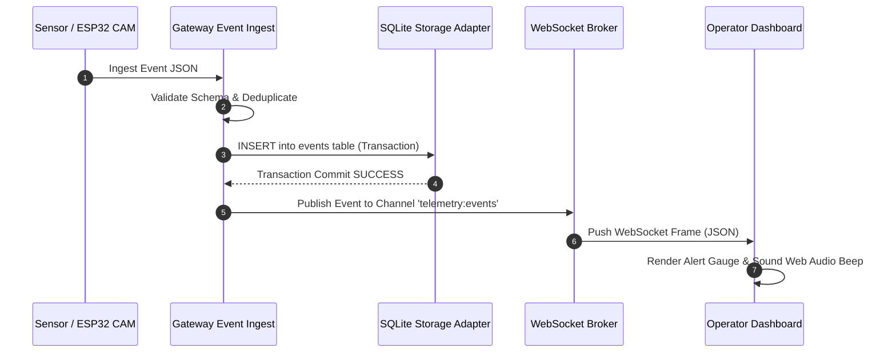

# 15 - Realtime Communication & WebSocket Specification

> **Document Status:** `[DECISION]` Realtime Push Protocol  
> **WebSocket Endpoint:** `ws://<gateway-ip>:8080/ws/v1/telemetry`  

---

## 1. Event Ingestion to Realtime Broadcast Ordering

To prevent race conditions where the UI displays an event that fails to persist in the database, the Gateway enforces a **Persist-Before-Publish Guarantee**:



---

## 2. WebSocket Channel & Frame Schema

Clients subscribe to designated channels by sending a subscription frame after handshake:

### 2.1 Client Subscribe Payload
```json
{
  "action": "SUBSCRIBE",
  "channels": ["system:risk", "telemetry:events", "devices:health"]
}
```

### 2.2 System Broadcast Frame Format (`system:risk`)
```json
{
  "channel": "system:risk",
  "timestamp_ms": 1727280000020,
  "payload": {
    "risk_score": 75,
    "risk_level": "CRITICAL",
    "previous_level": "ELEVATED",
    "primary_trigger_event_id": "9b1deb4d-3b7d-4bad-9bdd-2b0d7b3dcb6d",
    "active_device_count": 5
  }
}
```

---

## 3. Keep-Alive & Reconnection Strategy

* **Ping/Pong Heartbeat:** Gateway sends a WS `Ping` every 15 seconds. Client must respond with `Pong` within 5 seconds or connection is terminated.
* **Client Exponential Backoff:** On disconnect, UI dashboard reconnects using exponential backoff: $1\text{s}, 2\text{s}, 4\text{s}, 8\text{s}, \text{max } 30\text{s}$.
