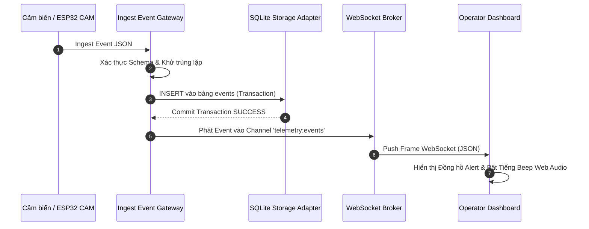

# 15 - Truyền thông Realtime & WebSocket Specification

> **Trạng thái Tài liệu:** `[DECISION]` Giao thức WebSocket Push Realtime  
> **Endpoint WebSocket:** `ws://<gateway-ip>:8080/ws/v1/telemetry`  

---

## 1. Thứ tự Từ Event Ingest đến Realtime Broadcast

Để tránh hiện tượng tranh chấp điều kiện (race conditions) khi UI hiển thị sự kiện nhưng lại thất bại khi lưu CSDL, Gateway bắt buộc áp dụng **Cam kết Lưu CSDL trước khi Phát (Persist-Before-Publish Guarantee)**:



---

## 2. Cấu trúc Payload & Subscriptions WebSocket

Client đăng ký theo dõi các channel chỉ định bằng cách gửi payload đăng ký sau handshake:

### 2.1 Payload Client Subscribe
```json
{
  "action": "SUBSCRIBE",
  "channels": ["system:risk", "telemetry:events", "devices:health"]
}
```

### 2.2 Định dạng Frame Broadcast từ Hệ thống (`system:risk`)
```json
{
  "channel": "system:risk",
  "timestamp_ms": 1727280000020,
  "payload": {
    "risk_score": 75,
    "risk_level": "CRITICAL",
    "previous_level": "ELEVATED",
    "primary_trigger_event_id": "9b1deb4d-3b7d-4bad-9bdd-2b0d7b3dcb6d",
    "active_device_count": 5
  }
}
```

---

## 3. Chiến lược Duy trì Kết nối Ping/Pong & Reconnect

* **Duy trì Heartbeat Ping/Pong:** Gateway gửi WS `Ping` mỗi 15 giây. Client bắt buộc phản hồi `Pong` trong 5 giây nếu không kết nối sẽ bị ngắt.
* **Tự động Reconnect với Exponential Backoff:** Khi bị ngắt kết nối, giao diện UI dashboard tự động thử lại theo cấp số nhân: $1\text{s}, 2\text{s}, 4\text{s}, 8\text{s}, \text{tối đa } 30\text{s}$.
