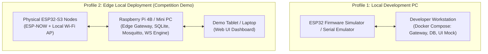

# 21 - Deployment Architecture & Environments

> **Document Status:** `[DECISION]` Deployment Topology & Container Blueprint  

---

## 1. Deployment Topology Comparison

The system supports 3 explicit deployment profiles tailored for development, live competition demo, and cloud hybrid scaling:

---

## 2. Low-Cost Edge Deployment Blueprint (Profile 2 - Competition Target)

| Component | Target Hardware | Estimated Cost | Installation Method |
| :--- | :--- | :--- | :--- |
| **Edge Gateway Host** | Raspberry Pi 4B (2GB/4GB) or Used Mini PC (Intel N100) | ~$45 – $75 | Docker Containers / `systemd` services on Ubuntu 22.04 |
| **MQTT Broker** | Eclipse Mosquitto | $0 (Open Source) | Lightweight Docker Container (`mosquitto:latest`) |
| **Database** | SQLite 3 / Embedded TimescaleDB | $0 (Open Source) | Single local file storage on High-End MicroSD / NVMe SSD |
| **Gateway Runtime** | Node.js (TypeScript) / Python runtime | $0 (Open Source) | Executed as supervised system service |
| **Vision Sensor** | ESP32-S3 CAM N16R8 | ~$7 – $9 per node | Flashed via USB-C (ESP-IDF / PlatformIO) |

---

## 3. Technology Decision Matrix

| Domain | Evaluated Options | Selected Option | Primary Decision Rationale |
| :--- | :--- | :--- | :--- |
| **Backend Runtime** | Node.js vs. Python vs. Go | **Node.js (TypeScript)** `[DECISION]` | Asynchronous I/O performance, native WebSocket support, unified language with frontend. |
| **Database** | SQLite vs. PostgreSQL vs. Redis | **SQLite (WAL Mode)** `[DECISION]` | Zero memory footprint, zero server administration, robust ACID transactions for edge. |
| **MQTT Broker** | Mosquitto vs. EMQX vs. VerneMQ | **Mosquitto** `[DECISION]` | Minimal memory footprint (<10MB RAM), student-friendly configuration. |
| **UI Framework** | React + Vite vs. Next.js vs. Vue | **React + Vite PWA** `[DECISION]` | Blazing fast build time, offline PWA caching support, zero server-side rendering complexity. |
