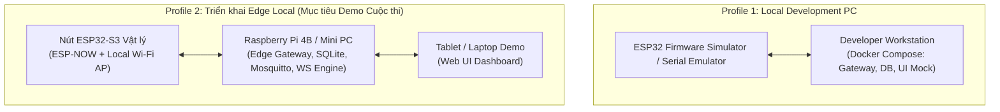

# 21 - Kiến trúc Triển khai (Deployment Architecture)

> **Trạng thái Tài liệu:** `[DECISION]` Mô hình Triển khai & Container Blueprint  

---

## 1. So sánh Các Phương án Triển khai Topology

Hệ thống hỗ trợ 3 profile triển khai được tối ưu hóa cho môi trường phát triển, demo cuộc thi và mở rộng cloud:

---

## 2. Blueprint Triển khai Edge Tiết kiệm Chi phí (Profile 2 - Mục tiêu Demo)

| Thành phần | Phần cứng Mục tiêu | Chi phí Ước tính | Phương pháp Cài đặt |
| :--- | :--- | :--- | :--- |
| **Edge Gateway Host** | Raspberry Pi 4B (2GB/4GB) hoặc Mini PC dùng lướt (Intel N100) | ~$45 – $75 | Docker Containers / dịch vụ `systemd` trên Ubuntu 22.04 |
| **MQTT Broker** | Eclipse Mosquitto | $0 (Mã nguồn mở) | Docker Container nhẹ (`mosquitto:latest`) |
| **Cơ sở Dữ liệu** | SQLite 3 / Embedded TimescaleDB | $0 (Mã nguồn mở) | File lưu trữ cục bộ duy nhất trên Thẻ nhớ MicroSD xịn / NVMe SSD |
| **Gateway Runtime** | Node.js (TypeScript) / Python runtime | $0 (Mã nguồn mở) | Chạy dạng tiến trình giám sát hệ thống |
| **Cảm biến Vision** | ESP32-S3 CAM N16R8 | ~$7 – $9 mỗi nút | Nạp mạch qua USB-C (ESP-IDF / PlatformIO) |

---

## 3. Ma trận Quyết định Lựa chọn Công nghệ (Technology Decision Matrix)

| Lĩnh vực | Các Phương án Đánh giá | Lựa chọn Đã chốt | Lý do Quyết định Cốt lõi |
| :--- | :--- | :--- | :--- |
| **Backend Runtime** | Node.js vs. Python vs. Go | **Node.js (TypeScript)** `[DECISION]` | Hiệu năng Async I/O cao, hỗ trợ native WebSocket mượt, đồng nhất ngôn ngữ với frontend. |
| **Cơ sở Dữ liệu** | SQLite vs. PostgreSQL vs. Redis | **SQLite (WAL Mode)** `[DECISION]` | Dung lượng RAM bằng 0, không cần quản trị server, giao dịch ACID tin cậy tại Edge. |
| **MQTT Broker** | Mosquitto vs. EMQX vs. VerneMQ | **Mosquitto** `[DECISION]` | Chiếm ít RAM cực kỳ (<10MB RAM), cấu hình đơn giản phù hợp sinh viên. |
| **UI Framework** | React + Vite vs. Next.js vs. Vue | **React + Vite PWA** `[DECISION]` | Tốc độ build siêu nhanh, hỗ trợ PWA offline caching, không phức tạp như SSR. |
